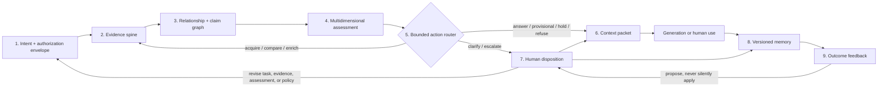

# Provisional framework component map

Status: `PROVISIONAL_RECONCILED_WITH_LIVE_V13_REFERENCE_EXACT_BYTES_PENDING`

Machine-readable counterpart: `FRAMEWORK_COMPONENT_MAP.json`

## What this map is—and is not

This is the smallest coherent architecture currently supported by the owner's question, the complete rendered live v13 reference, and independent prior-art review. It proposes an explicit systems responsibility for deciding what information may influence generation, under stated task, evidence, cost, and human-control constraints.

It is not an exact-byte reconstruction of v13, a claim of mechanism novelty, a universal object model, or a validated implementation. It intentionally redesigns v13's peripheral-mining-centered map around inspectable context judgment. The missing standalone v13 bytes, research archive, and migration packet may still narrow it. Alpha Solver and Signal Foundry are bounded implementation examples only.

The word **layer** denotes a responsibility. It need not be one service or one sequential pipeline. The central design move is to keep unlike judgments typed and inspectable rather than compressing them into a master “relevance,” “trust,” or “importance” score.

## Framework at a glance

### Text equivalent

1. A human or authorized process defines the question, intended use, baseline, permissions, and budgets.
2. Acquisition captures artifacts and records source, artifact, version, and transformation provenance.
3. Relationship and claim graphs separate recurrence from independence, connect exact evidence to exact claims, and expose contradictions and expected gaps.
4. Assessment records attention, authority, support, independence, relevance, enrichment value, action priority, and owner disposition as distinct judgments. Uncertainty and possible consequence qualify those judgments as explicit attributes rather than becoming a master score.
5. A bounded router chooses among acquire, compare, enrich, clarify, answer, answer provisionally, hold, defer, escalate, or refuse.
6. Selected material becomes a versioned context packet with citations, reasons, exclusions, uncertainty, and constraints.
7. A human can accept, reject, defer, override, correct, or request more work. The system cannot infer operational authority from source authority.
8. Evidence, interpretations, decisions, packets, outputs, and corrections remain separately versioned.
9. Only a defined later outcome can motivate a learning update, and the update is proposed for disposition rather than silently applied.

## Six mechanism families

| Family | Responsibility | Components |
| --- | --- | --- |
| Intent and authorization envelope | Establish why work is occurring, what is expected, what is permitted, and what it may cost. | C01 |
| Evidence spine | Acquire, identify, normalize, version, and trace material without confusing capture with acceptance. | C02–C03 |
| Relationship and claim graph | Represent common origin, recurrence, comparison, atomic claims, support, contradiction, and gaps. | C04–C05 |
| Discrimination policy | Keep assessment dimensions separate, select a bounded next action, and package context. | C06–C08 |
| Human disposition and memory | Make correction and override explicit; preserve evidence, decision, and memory history. | C09–C10 |
| Outcome feedback | Compare expected and observed consequences and propose revisable updates. | C11 |

## Component specification

Each component answers the same nine questions: what it is, why it is needed, what it consumes and produces, how it interacts, how it fails, a bounded example, what evidence supports it, and what remains speculative.

### C01. Decision brief and authorization envelope

**What it is.** A versioned declaration of the question, intended use, decision owner, stakes, expected baselines, permitted operations, sensitive-source rules, and resource limits.

**Why needed.** Relevance, meaningful absence, cost, and permissible action have no stable meaning without a task and authority boundary.

**Consumes.** The owner's question or decision; audience and use; constraints; privacy, retention, disclosure, and tool permissions; budgets; expected sources, perspectives, fields, or observations.

**Produces.** A decision-brief version, authorization-policy version, expected baseline, cost envelope, and success, abstention, or escalation criteria.

**Interactions.** It constrains acquisition and transformation, defines the task frame for assessment, supplies gap baselines, and defines outcome windows.

**Known failures.** Vague questions; access mistaken for authorization; baselines invented after seeing results; omitted review or privacy costs; downstream work surviving a material brief change without revalidation.

**Bounded example.** A research assistant may search public sources for two hours, may not upload confidential material, must compare three named perspectives, and must escalate high-impact unsupported claims.

**Evidence maturity.** Prior-art-supported conceptual synthesis. Value of information, mixed initiative, decision-quality practice, and risk management motivate the responsibility; they do not validate this particular envelope.

**Speculative.** The minimum portable schema and reliable automated detection of an inadequate brief.

### C02. Acquisition controller

**What it is.** A policy-governed mechanism that proposes, authorizes, records, and stops retrieval or collection actions.

**Why needed.** Relevant evidence may be absent, but retrieval has cost and risk. A decision to look cannot become a decision to believe.

**Consumes.** The brief and permission policy; candidate queries, sources, and tools; current gaps and uncertainty; estimated information gain; remaining budget.

**Produces.** An acquisition proposal, authorization result, capture or failure receipt, immutable raw-artifact reference, and budget update.

**Interactions.** It receives targeted gaps and enrichment proposals from C04, C05, and C07, hands captures to C03, and reports costs and failures to routing and outcome evaluation.

**Known failures.** Scope creep; paid or private acquisition without permission; novelty mistaken for value; failed capture treated as negative evidence; unbounded search.

**Bounded example.** Because commentary is the only current support for a consequential claim, the system proposes one primary-standard search and records expected benefit, cost, permission, result, and stopping reason.

**Evidence maturity.** Prior-art-supported design hypothesis. Information foraging, relevance feedback, active learning, and value-of-information research provide precedents.

**Speculative.** Reliable open-world value estimates and stopping policies that transfer across domains.

### C03. Source, artifact, normalization, and provenance spine

**What it is.** Stable identities and append-only derivation records for sources, artifacts, captures, versions, transformations, agents, and times.

**Why needed.** Audit and comparison fail when sources and artifacts are conflated, normalization erases differences, or summaries become detached from origin.

**Consumes.** Captures, source observations, artifact bytes or stable references, transformation specifications, and agent or tool versions.

**Produces.** Source and artifact identities, version or content hash, normalized representations, derivation edges, and explicit identity ambiguity.

**Interactions.** It grounds both graphs, accompanies context packets and memory, and lets human corrections point to exact evidence.

**Known failures.** False merges; duplicate counting; qualifier loss; provenance laundering through summary or embedding; unversioned mutable pages; lineage presented as correctness.

**Bounded example.** A web page, issuing organization, retrieval time, hash, extracted text, parser version, and paragraph offsets are linked but distinct records.

**Evidence maturity.** Prior-art-supported conceptual synthesis grounded in provenance, data-lineage, and evidence-synthesis practice.

**Speculative.** Accurate identity resolution across aliases and complete lineage through opaque provider transformations.

### C04. Relationship, recurrence, common-origin, and gap graph

**What it is.** A typed graph among sources, artifacts, events, groups, observations, time points, copies, derivations, recurrences, comparisons, and expected-but-missing perspectives.

**Why needed.** Several reports can share one origin; cohorts can be temporary analytical roles; absence and velocity require baselines and repeated observations.

**Consumes.** Identified sources and artifacts, provenance, timestamps, grouping rules, expected baselines, similarities, and citations.

**Produces.** Typed relationships, candidate common-origin clusters, recurrence with dependence state, comparison sets, cohort roles, gap records, time-series observations, and explicitly derived signal candidates.

**Interactions.** It uses C03 identity, informs C05 independence, shapes C06 attention and enrichment, and can request C02 acquisition.

**Known failures.** Syndication counted as corroboration; unknown origin labeled independent; similarity labeled causation; essentialized cohorts; velocity from one observation; absence without a baseline; signal candidate shown as fact.

**Bounded example.** Nine articles repeating one vendor announcement remain nine observations, but one known origin—not nine distinct origins under the packet’s relation rule.

**Evidence maturity.** Prior-art-supported design hypothesis drawing on evidence synthesis, provenance, coordinated-amplification research, and sensemaking.

**Speculative.** Automated common-origin inference and general definitions for gaps, velocity, and recurrence.

### C05. Claim, evidence, comparison, and contradiction graph

**What it is.** A claim-level representation connecting atomic propositions to exact evidence spans, support states, qualifications, contradictions, alternatives, and unresolved questions.

**Why needed.** One credible artifact can contain differently supported claims, and a citation or document score cannot show what a conclusion rests on.

**Consumes.** Exact artifact spans, candidate claims, identities, common-origin relationships, domain evidence standards, and comparison frames.

**Produces.** Versioned claims; support, contradiction, qualification, and insufficiency edges; rationales; unresolved items; alternatives; comparison matrices.

**Interactions.** It consumes C03–C04 structure, supplies claim support and uncertainty to C06, and provides cited material for C08.

**Known failures.** Untestable claim breadth; citation treated as entailment; authority transferred across claims; lexical overlap treated as evidence; incomparable definitions aligned; open-world unknown forced into a binary verdict.

**Bounded example.** A sentence's measured result links to a table, while its causal explanation remains insufficient because the study design does not identify causality.

**Evidence maturity.** Prior-art-supported conceptual synthesis grounded in claim-verification benchmarks, evidence synthesis, and structured analysis.

**Speculative.** Domain-general claim decomposition and portable evidence standards.

### C06. Multidimensional assessment

**What it is.** Separate task-scoped judgments for attention priority, domain source authority, claim support, independence, relevance, enrichment value, action priority, and owner disposition. Uncertainty and possible consequence are explicit attributes that qualify an assessment or route; they are not additional interchangeable scores.

**Why needed.** A master trust or relevance score hides why an item can influence a decision and makes a specific error difficult to correct.

**Consumes.** The brief, source and artifact records, both graphs, current uncertainty, and possible consequences.

**Produces.** Typed assessments with reasons and evidence, unknown or contested states, action considerations, and review queues.

**Interactions.** It receives C01 and C03–C05 structure, supplies—but does not dictate—C07 routing, and exposes each dimension to C09 correction.

**Known failures.** Score collapse; owner interest recorded as endorsement; categorical rejection or universal trust of first-party material; model confidence substituted for support; precise scores hiding identity uncertainty.

**Bounded example.** A regulatory filing may be authoritative for what was filed, strongly support its filing date, weakly support a causal explanation, be highly relevant, and remain linked to a press release under the stated origin rule.

**Evidence maturity.** Conceptual synthesis requiring evaluation. Adjacent evidence supports the distinctions but not the proposed combination.

**Speculative.** Reliable human/model application and net benefit relative to simpler ranking.

### C07. Enrichment, stopping, and action router

**What it is.** A policy comparing permitted next actions under uncertainty and resource limits: acquire, compare, enrich, clarify, answer, answer provisionally, hold, defer, escalate, or refuse.

**Why needed.** Assessment matters only when it guides a bounded next step; the selected action is still not a factual conclusion.

**Consumes.** Separate assessments, evidence and gap states, allowed actions, budgets, expected benefit and consequence, deadlines, and stopping criteria.

**Produces.** A recommended action, alternatives where useful, reason code, expected benefit and cost range, uncertainty, and a stop or escalation receipt.

**Interactions.** It can loop to acquisition and comparison, request human authorization, and pass a chosen set toward packaging. Its predictions and costs go to outcome evaluation.

**Known failures.** Enrichment treated as acceptance; false utility precision; convenience stopping; endless search; unauthorized routing; attention priority treated as truth.

**Bounded example.** With one vendor-linked source and no separately rooted support established for a high-impact claim, the router allows one fifteen-minute primary-source search, then requires a provisional answer naming the gap.

**Evidence maturity.** Prior-art-supported design hypothesis grounded in value of information, metareasoning, resource rationality, and mixed initiative.

**Speculative.** Robust utilities, harm modeling, and portable policy vocabularies.

### C08. Bounded context packet

**What it is.** A versioned package of selected content plus provenance, claim links, inclusion and exclusion reasons, unresolved states, budgets, and generation constraints.

**Why needed.** A generator needs usable context and a reviewer needs to know what influenced it. An unstructured long prompt satisfies neither requirement reliably.

**Consumes.** The authorized route, selected spans and claims, provenance, assessments, exclusions, unresolved gaps, and token or disclosure limits.

**Produces.** A packet version, selection manifest, exclusion manifest, citation map, uncertainty and abstention instructions, and generator-input receipt.

**Interactions.** It binds C03–C07 outputs, is reviewable through C09, and links its later use to C10–C11.

**Known failures.** Lossy compression; ordering bias; invisible exclusion; provenance removed for brevity; context mislabeled as evidence; sensitive disclosure.

**Bounded example.** A packet includes three exact passages, claim and common-origin links, one excluded duplicate, one unresolved counterclaim, a token budget, and an instruction not to fill the gap.

**Evidence maturity.** Design hypothesis with adjacent precedent in RAG, context engineering, long-context behavior, and provenance.

**Speculative.** Optimal packet structure and the minimum provenance that preserves correction value.

### C09. Owner disposition, review, and override

**What it is.** A human control surface for accept, reject, defer, hold, override, request enrichment, correct relationships, and revise constraints.

**Why needed.** The responsibility is intended to remain correctable, and some judgments or permissions belong to a domain expert or owner.

**Consumes.** Assessment and route receipts, packet, evidence path, uncertainty, costs, consequences, and reviewer authority.

**Produces.** A disposition, reason, override, correction request, changed constraint, or escalation destination.

**Interactions.** It can revise the brief, correct graph or assessment records, approve a route, alter a packet, and supply decisions to memory and outcome analysis.

**Known failures.** Rubber-stamping; conclusions without evidence paths; preferences stored as fact; anonymous or reasonless overrides; review overload; insufficient access to correction context.

**Bounded example.** An analyst rejects an independence label, links two reports to one shared study, records why, and recomputes the route without editing either capture.

**Evidence maturity.** Prior-art-supported design hypothesis grounded in mixed initiative, HCI, structured analysis, and risk management.

**Speculative.** Meaningful review interfaces and portable divisions of decision authority.

### C10. Versioned evidence, decision, and memory ledger

**What it is.** Append-only retention of observations, interpretations, decisions, packets, outputs, corrections, and supersession relationships, with current views built over history.

**Why needed.** Learning and audit require history; mutable memory can erase why a decision was made or launder an earlier error.

**Consumes.** Records from C01–C09, retention and access policy, correction events, and prompt/model/tool versions.

**Produces.** Immutable events, current materialized views, supersession links, origin-bound retrieval indexes, audit timelines, and staleness flags.

**Interactions.** It preserves each stage, supplies authorized prior cases to assessment and routing, and supports outcome comparison.

**Known failures.** Summaries overwrite evidence; retrieved memory loses epistemic type; preference becomes fact; over-retention; unusable version proliferation; repetition creates authority; memory poisoning.

**Bounded example.** A corrected claim does not delete its earlier form; the stale form is superseded and excluded from default retrieval while its original evidence and decision context remain inspectable.

**Evidence maturity.** Design hypothesis with adjacent precedent in provenance, agent memory, organizational learning, and lineage.

**Speculative.** Safe cross-task reuse and scalable origin preservation through memory consolidation.

### C11. Outcome feedback and revisable policy update

**What it is.** A controlled comparison of recorded predictions, decisions, costs, and expected outcomes with defined later observations, followed by a proposed—not silent—update.

**Why needed.** A learning claim is empty without a predefined outcome, measurement window, attribution boundary, and retained prior state.

**Consumes.** Decision and route receipts, an objective or prediction, actual cost, time-stamped outcome, confounders, missingness, and policy versions.

**Produces.** Expected-versus-observed comparison, calibration or error record, proposed update or no-update decision, and new evidence questions.

**Interactions.** It reads C10 histories, may propose changes to C01, C06, or C07, and routes every proposal through C09.

**Known failures.** Outcome defined after the fact; proxy confusion; causal storytelling; selective follow-up; local preference generalized; automatic learning from contaminated feedback.

**Bounded example.** A system records that one extra search should resolve dependence within twenty minutes, later records whether it did and its actual cost, then proposes a stopping-rule revision for review.

**Evidence maturity.** Design and empirical hypothesis informed by calibration, organizational learning, decision quality, and human-in-the-loop research.

**Speculative.** Field attribution and learning that improves calibration without preference capture.

## The distinctions the architecture must preserve

| Dimension or record | Question it answers | It is not |
| --- | --- | --- |
| Attention priority | What deserves inspection now? | Truth or authority |
| Domain source authority | For which narrow claim types does the source have competence or standing? | Universal trust or operational permission |
| Claim support | How does exact evidence bear on an exact claim? | Popularity, recurrence, or confidence alone |
| Independence | Do reports arise from materially different origins or pathways? | Different URLs or wording |
| Recurrence | How often has something appeared? | Independent corroboration |
| Relevance | How does this bear on the present question? | General importance or endorsement |
| Enrichment value | What might another bounded operation resolve? | Acceptance or permission |
| Action priority | Which permitted next step best fits consequence, uncertainty, and cost? | A factual conclusion |
| Owner disposition | What human choice applies to this version in this context? | Objective truth or permanent preference |
| Observed metadata | What was directly recorded, when, and from where? | Interpretation or prediction |
| Provenance | Where did this come from and how was it transformed? | Correctness, support, independence, relevance, or authorization |

A first-party source can strongly support a narrow first-party claim. It cannot thereby validate every causal or comparative claim it makes. Several apparently distinct sources can derive from one common origin. Unknown dependence must remain unknown rather than becoming independent by default.

## Object and state model

The principal objects are: decision brief, authorization policy, source, artifact, capture, observation, claim, evidence span, relationship, assessment, gap, signal candidate, route, context packet, human disposition, generated output, outcome, and policy version.

The conceptual lifecycle is:

`PROPOSED → AUTHORIZED | NOT_AUTHORIZED → OBSERVED | FAILED → IDENTIFIED → RELATED → ASSESSED → ROUTED → HELD | EXCLUDED | DISPOSED → PACKAGED → USED → OUTCOME_RECORDED → PRIOR_UPDATE_PROPOSED → SUPERSEDED`

This is not one mandatory linear implementation. Different object types use different states. Every material transition needs a receipt that identifies the object version, actor or policy, inputs, reason, time, and authorization. `STALE` may attach whenever source time, task changes, or policy changes invalidate current use.

## Cost and stopping boundary

Every acquisition or enrichment route must name the resources it can consume:

- money and provider spend;
- elapsed time and latency;
- tokens, compute, and storage;
- reviewer and domain-expert attention;
- privacy, confidentiality, and disclosure exposure;
- retention and compliance burden;
- opportunity cost of delay or abstention.

A useful stopping receipt states the current uncertainty, candidate next action, expected improvement, cost or range, remaining budget, chosen action, and why alternatives were declined. It need not pretend those estimates are exact.

## Provenance boundary

- Raw acquisition artifacts remain audit evidence, not analysis-ready conclusions.
- Normalization, summarization, embedding, extraction, and generation create new derived entities.
- Observed metadata and inferred relationships remain distinct record types.
- Every assessment and route names its inputs, policy or rubric, actor, time, and uncertainty.
- Human dispositions and outcome observations never overwrite source evidence.
- Unknown origin and unknown independence remain explicit.
- Context packets preserve both inclusion and material exclusion receipts.
- Memory consolidation cannot sever the path to origin.

## Failure conditions for the framework as a whole

The framework should be narrowed or rejected for a task when:

- its distinctions cannot be applied consistently enough to inform action;
- it adds review and representation cost without a measurable gain over ordinary retrieval, citations, and human review;
- provenance detail creates false confidence rather than better correction;
- the router cannot represent authorization, asymmetric harm, or uncertainty without misleading precision;
- outcome feedback reinforces preference, bias, or manipulation rather than decision quality;
- simpler domain-specific methods already solve the bounded problem more clearly;
- the term or visual model produces a materially wrong reader understanding even after explanation.

## Minimum implementation claim

An implementation does not need eleven services, a graph database, or one universal schema. To instantiate the proposed responsibility at all, it should make at least these things explicit:

1. task and authorization framing;
2. source/artifact identity and provenance;
3. claim and relationship representation appropriate to the domain;
4. separate assessment dimensions;
5. bounded routing and stopping;
6. human correction and override;
7. versioned outcome feedback whenever learning is claimed.

Without those boundaries, “discrimination layer” risks becoming a label for ordinary retrieval or ranking.

## Open questions

- What is the smallest set of objects and judgments that improves a decision?
- Which tasks warrant this overhead, and which should use simpler retrieval or direct generation?
- Can reviewers distinguish authority, support, independence, relevance, attention, and action reliably?
- How should partial or unknown dependence be represented?
- How should asymmetric harms and unknown utilities affect stopping?
- Which provenance fields survive summarization and memory while remaining usable?
- How can outcome learning resist hindsight bias, preference capture, coordinated amplification, and memory poisoning?
- Would the exact standalone v13 archive reveal a material difference from the inspected live reference?

## Reconciliation rule

If the standalone v13 files arrive, compare every component, term, relationship, and claimed dependency against those exact bytes and the already inspected live reference. Record whether each is `CONFIRMED`, `NARROWED`, `REPLACED`, `NEW_SYNTHESIS`, or `REJECTED`. Do not revise this map in place without retaining that reconciliation receipt.
