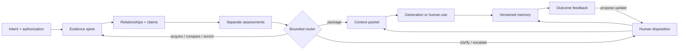

# Pattern Recognition: The Discrimination Layer

## A visual systems framework for deciding what information deserves acquisition, comparison, enrichment, and influence before AI generates

Version: 14 · reader-review draft

Status: `READY_FOR_OWNER_REVIEW`
Evidence posture: conceptual synthesis and research agenda; not empirical validation, peer review, or deployment guidance

---

## Five-minute version

### The problem

A model can write a polished answer from a poor evidence environment.

The visible failure arrives at the end—a generic recommendation, a confident mistake, a summary that misses the interesting exception. But the consequential decisions often happened earlier:

- Which information was available at all?
- Which sources and artifacts were treated as distinct?
- Which repeated claims were actually copies of one origin?
- Which evidence supported which claim?
- What was missing relative to a reasonable expectation?
- Was another search worth its cost?
- What entered the final context, what was withheld, and why?
- Who could correct the decision?
- What later outcome, if any, should change the next one?

Retrieval helps find material. Provenance helps trace it. Claim verification helps test bounded propositions. Human review can help correct a system. The inspected literature now contains multiple integrated systems spanning overlapping parts of that responsibility, including cross-source verification, conflict modeling, source-aware attribution, adaptive search, and evidence interfaces. This thought piece does not claim an unoccupied universal layer; it asks whether keeping several judgments visibly separate is useful, then narrows the first empirical test to one origin-relation cue.

### The thesis

Some evidence-sensitive AI workflows may benefit from an explicit responsibility for deciding what context to acquire, identify, preserve, compare, enrich, admit, withhold, and update before generation.

I call that responsibility the **discrimination layer**. Here, *discrimination* means technical differentiation, selection, and judgment—not social classification or discriminatory treatment. A layer is a responsibility, not necessarily one service, model, or box.

The responsibility should be:

- **inspectable:** a person can see the evidence path, reasons, exclusions, and uncertainty;
- **cost-bounded:** search, enrichment, computation, disclosure, and review have explicit limits;
- **source-aware:** source, artifact, claim, and derivation identities remain distinct;
- **correctable:** a human can contest the frame, evidence, assessment, route, or memory;
- **revisable:** later outcomes may motivate a new policy without rewriting the old record.

That is a design proposition, not a result. The open question is whether making this responsibility explicit improves decisions enough to justify its cost.

### The framework at a glance

| Family | The question it answers | Principal output |
| --- | --- | --- |
| 1. Intent and authorization | What are we deciding, what is expected, what is allowed, and what can it cost? | A versioned decision brief and permission envelope |
| 2. Evidence spine | What did we acquire, from whom, in which version, and through which transformation? | Identity, capture, and provenance records |
| 3. Relationship and claim graph | What is related, repeated, dependent, supported, contradicted, or missing? | Typed relationships and claim-evidence states |
| 4. Discrimination policy | Which separate judgments apply, and what permitted step should happen next? | Assessments, a route, and a bounded context packet |
| 5. Human disposition and memory | What did the owner accept, reject, defer, or correct, and what history should remain? | A disposition and versioned ledger |
| 6. Outcome feedback | What happened later, and should any policy change? | An expected-versus-observed comparison and proposed update |

The flow is not a conveyor belt. A gap can trigger another search. A reviewer can revise the question. A failed capture can end a branch. An outcome can propose—but should not silently apply—a new weighting rule.

### One worked example

**Illustrative example—not a reported case or result.**

A technical team is deciding whether to run a sandbox pilot of a new data-migration tool. Search returns nine positive articles, the vendor documentation, a vendor benchmark, and two issue reports describing rollback failures.

A flat summary might say that the tool is widely praised, supports rollback, and is substantially faster.

The discrimination layer asks different questions:

1. **Intent and authorization.** The decision is only whether to run a sandbox pilot. No production or customer data is authorized. Research has a ninety-minute limit.
2. **Evidence spine.** The system records each page, publisher, capture time, version, and derivation. All nine positive articles turn out to paraphrase the same launch announcement.
3. **Relationships and claims.** Nine mentions remain nine observations, but they establish only one known origin under the packet’s relation rule—not nine distinct origins. The feature claim “rollback is supported” links to official documentation. The performance claim links only to the vendor's benchmark. The failure reports are relevant but do not yet establish prevalence.
4. **Separate assessments.** The vendor is authoritative about what it documents; the packet does not establish separately rooted comparative-performance support. The issue reports have high attention priority but unresolved representativeness. All three claim types are relevant; none receives a universal trust score.
5. **Route.** Given the remaining time, the system recommends reading the benchmark method and reproducing one rollback path locally. If that cannot be done, it recommends a provisional brief rather than another broad search.
6. **Context packet.** The decision maker receives the exact documentation, benchmark caveats, both failure reports, the common-origin note, one excluded duplicate, the budget used, and the unresolved questions.
7. **Disposition and outcome.** The owner may approve a sandbox-only pilot, reject it, or defer. If a pilot occurs, its predefined rollback and migration outcomes can inform a later decision. They do not rewrite the external evidence or prove that the tool is generally good or bad.

The point is not that the framework magically knows the answer. The point is that it makes the path to a bounded action visible and correctable.

### Why the distinctions matter

The framework refuses several convenient collapses:

| This | Is not this |
| --- | --- |
| Attention priority | Truth |
| Domain source authority | Universal trust or permission to act |
| Claim support | Source popularity |
| Recurrence | Independence |
| Independence | Different wording, URLs, or unknown origin |
| Relevance | General importance |
| Owner interest | Endorsement |
| Operational authorization | Domain source authority or technical access |
| Enrichment value | Action priority or acceptance |
| Action priority | A factual conclusion or truth probability |
| Provenance | Correctness |
| A signal candidate | A verified event or conclusion |
| A decision to acquire more information | A factual conclusion |

Those separations sound fussy until a system gets one of them wrong. A widely repeated press release can look like corroboration. A high-priority safety report can look like an established fact. An official source can be the best evidence for what it announced and poor evidence for whether the product works. A detailed provenance graph can faithfully trace a false claim.

The relations themselves also need levels. A **derivation relation** says copied, paraphrased, summarized, translated, quoted, or inferred. An **origin-family relation** says same upstream origin, distinct origin, or unresolved origin. A **claim-stance relation** says supports, refutes, qualifies, or is insufficient. An **action relation** says provisional, hold, escalate, authorized, or unauthorized. One generic `relation` field cannot safely stand in for all four.

### What remains unresolved

The framework could fail for straightforward reasons:

- It may be a more elaborate diagram around mechanisms that existing systems already combine well.
- Reviewers may not be able to apply its distinctions consistently.
- A simpler retrieval-plus-citation workflow may perform just as well at lower cost.
- Common-origin analysis may suppress genuine convergence or miss coordinated copying.
- Source authority and selection policies may harden institutional bias.
- Human review may become ceremonial.
- Outcome feedback may encode one owner's taste or a contaminated proxy as truth.
- The term *discrimination layer* may communicate the wrong idea despite explanation.

Those are not footnotes. They are tests. Until they are run, the maximum claim is that this is a coherent, historically grounded framework worth examining—not that it is complete, novel as a scientific mechanism, or effective.

---

## Complete version

### Where the idea came from

The [v13 visual map](https://pattern-recognition-map.adonisdv23.chatgpt.site/) began with a practical frustration: much AI-assisted work can feel competent and still feel stale. Its answer was **pattern recognition before generation**. Look beyond the most visible material; find the specialist comment, the repeated unanswered question, the unusual rate of change, the disclosure that differs from its peers, or the prior observation that changes what the current one means.

V13 put **peripheral signal mining** in the center. Around it sat source weighing, velocity, absence and memory, structured peer patterns, and a learning loop. It also made an essential correction to its own premise: less-visible material is not more truthful. The periphery contains insight, noise, manipulation, copied claims, and ordinary irrelevance. Underweighted is a starting condition, not a conclusion.

That remains the pulse of this piece.

The revision changes the architecture around it. “Peripheral” is relative to a task and an observed corpus; we usually do not know what a model's training distribution contains. Recurrence across communities is not necessarily independent evidence. Source track record is not claim support. A velocity anomaly deserves attention, not belief. A gap is meaningful only against an expected baseline. A learning loop is not learning unless an outcome was defined before the story was told.

The earlier map asked: *How do we find the material generic workflows miss?* V14 keeps that question and adds a harder one: *What gives any item the right to influence the answer?*

### The problem is context judgment, not context volume

Retrieval-augmented generation established a practical way to condition generation on external material [years ago](https://papers.neurips.cc/paper/2020/hash/6b493230205f780e1bc26945df7481e5-Abstract.html). Long-context systems can hold more material, but evaluations show that models may use relevant information unevenly depending on its position and the task ([Liu et al., 2024](https://aclanthology.org/2024.tacl-1.9/)). More room does not remove the need to decide what belongs in it.

The decision is not one-dimensional. Consider a single document:

- It can be authoritative for what an organization officially announced.
- It can weakly support a claim about whether the announcement will succeed.
- It can be highly relevant to the current decision.
- It can be derived from another source and add no distinct-origin support under the stated relation rule.
- It can deserve immediate attention because the cost of ignoring it is high.
- It can still be withheld because using it would violate a privacy or authorization boundary.

Calling the document “trusted,” “important,” or “high quality” erases those differences. The design proposition is that a universal score may make ranking easy while making the source of a mistake harder to inspect and correct; that proposition still requires comparative evaluation.

The proposed layer therefore does not decide which sources are good. It records a set of typed, scoped judgments and uses them to choose a permitted next action.

### Why call it a discrimination layer?

The word points to a capability that retrieval alone does not name: distinguishing unlike things and judging how they should be treated. The historical map used it for sifting peripheral material before generation. V14 uses it for the broader responsibility that connects acquisition, evidence, comparison, routing, and revision.

The term carries a serious ambiguity. In ordinary and legal contexts, discrimination often concerns unjust treatment or protected classes. That is not the intended meaning, and a technical definition does not make the social meaning disappear. If representative readers continue to infer the wrong thesis after the definition, the title should change. **Context judgment layer** is the cleanest current alternative.

The term *layer* is also conceptual. An implementation might distribute the work across a search service, provenance store, claim graph, policy engine, interface, and memory system. A prompt template can instantiate a small portion. A component named `discrimination` can instantiate none of it.

### When this framework is worth the overhead

The framework is aimed at tasks where evidence selection can materially change a decision:

- claims are consequential, disputed, time-sensitive, or source-dependent;
- several reports may share one origin;
- missing perspectives or longitudinal state matter;
- acquisition or enrichment is costly;
- sensitive information or role permissions constrain use;
- a human must be able to inspect and correct the path;
- later outcomes can be defined and responsibly observed.

It is probably unnecessary for a low-stakes rewrite, a calculation from complete supplied inputs, or a direct creative task where no factual evidence claim is made. Complexity is not a badge of seriousness. If ordinary retrieval, clear citations, and review solve the problem under matched constraints, use them.

## The system

### Six families, eleven responsibilities

Text equivalent: a bounded question and permission envelope governs acquisition. Captured material receives stable source, artifact, version, and derivation records. Relationship and claim views expose common origin, recurrence, support, contradiction, and gaps. Separate assessments inform a cost-bounded route. Selected material becomes an inspectable context packet. A human can correct or override the route. Evidence, decisions, and outputs remain versioned. Defined outcomes may later motivate an approved policy update.

The component map below is deliberately more explicit than the eventual user interface. Its purpose is to make hidden dependencies visible.

### C01. Decision brief and authorization envelope

**What is it?** A versioned statement of the question, intended use, decision owner, stakes, expected baselines, allowed operations, sensitive-source rules, and budgets.

**Why does it exist?** Relevance and meaningful absence are task-relative. Acquisition and disclosure require permission. Stopping requires a budget and consequence frame.

**What does it consume?** The owner's question; audience and use; known constraints; privacy, retention, disclosure, and tool permissions; time, money, token, compute, and attention limits; expected sources or perspectives.

**What does it produce?** A decision-brief version, permission policy, expected baseline, cost envelope, and success, abstention, or escalation criteria.

**How does it interact?** Every later record points to this version. It constrains acquisition, defines relevance, gives gaps a baseline, and names the outcomes that feedback may later compare.

**What can go wrong?** Technical access is mistaken for authorization. A vague question makes relevance arbitrary. A baseline is invented after seeing the evidence. A material brief change fails to invalidate old work.

**Example.** The migration-tool brief authorizes public-source research and a synthetic-data sandbox, prohibits production data, and limits the initial decision to whether a pilot is warranted.

**What evidence supports it?** Decision analysis, value-of-information work, mixed-initiative design, and risk-management practice all make task, cost, and authority framing consequential. They do not validate this schema.

**What remains speculative?** The minimum useful brief and whether one representation can travel across domains without flattening their different evidence and permission rules.

### C02. Acquisition controller

**What is it?** A governed mechanism that proposes, authorizes, records, and stops retrieval or collection actions.

**Why does it exist?** Evidence can be absent from current context, but one more search consumes time, money, compute, attention, and sometimes privacy. Information foraging and value-of-information research already treat search as a resource-bounded decision ([Pirolli & Card, 1999](https://doi.org/10.1037/0033-295X.106.4.643); [Howard, 1966](https://doi.org/10.1109/TSSC.1966.300074)).

**What does it consume?** The brief; candidate sources, queries, and tools; current gaps and uncertainty; expected improvement; remaining budget.

**What does it produce?** An acquisition proposal, authorization result, capture or failure receipt, immutable raw-artifact reference, and budget update.

**How does it interact?** It receives targeted gaps from the graph and router, gives captures to the evidence spine, and reports costs and failures to later evaluation.

**What can go wrong?** Novelty is mistaken for value. Scope expands silently. A paid, private, or sensitive retrieval runs without permission. A failed capture becomes negative evidence. Search continues because no stop state exists.

**Example.** Instead of searching broadly for more praise, the router authorizes one targeted search for a separately authored rollback test—whose origin relation still must be assessed—because that evidence could change the pilot decision.

**What evidence supports it?** Information foraging, relevance feedback, active learning, value of information, and metareasoning provide strong precedents for bounded selection.

**What remains speculative?** Reliable value estimates in open-world research, particularly when harms are asymmetric and the most important evidence may be rare.

### C03. Source, artifact, normalization, and provenance spine

**What is it?** Stable identities and append-only derivation records for sources, artifacts, captures, versions, transformations, actors, and times.

**Why does it exist?** A source is not an artifact. A mutable page is not one timeless object. A normalized extract is not the original. A summary should not acquire authority by losing its origin.

**What does it consume?** Raw captures, source observations, artifact bytes or stable references, transformation specifications, and tool versions.

**What does it produce?** Source and artifact identities, version or hash, normalized representations, provenance edges, and explicit identity ambiguity.

**How does it interact?** It grounds both graphs, travels with context packets and memory, and lets a correction point to exact evidence. [W3C PROV-O](https://www.w3.org/TR/prov-o/) is direct prior art for entities, activities, agents, and derivations.

**What can go wrong?** False merges, duplicate counting, qualifier loss, provenance laundering through summaries or embeddings, unversioned page changes, and the presentation of lineage as truth.

**Example.** The vendor documentation, issuing organization, capture time, page version, extracted text, and parser version are linked but separate records.

**What evidence supports it?** Provenance standards, data lineage, and evidence-synthesis practice strongly support traceable derivation.

**What remains speculative?** Reliable identity resolution across aliases and complete provenance through providers whose internal transformations are opaque.

### C04. Relationship, recurrence, common-origin, and gap graph

**What is it?** A typed graph among sources, artifacts, events, observations, time points, copies, derivations, recurrences, comparison sets, cohorts, and expected-but-missing perspectives.

**Why does it exist?** Repetition does not establish distinct-origin support. Evidence-synthesis practice explicitly distinguishes multiple reports from multiple underlying studies ([Cochrane Handbook, chapter 4](https://www.cochrane.org/authors/handbooks-and-manuals/handbook/current/chapter-04)). Velocity needs repeated time-stamped observations. Meaningful absence needs an expected baseline.

**What does it consume?** Identified sources and artifacts, provenance, timestamps, grouping rules, expected baselines, similarity observations, and citations.

**What does it produce?** Typed relationships, candidate common-origin clusters, recurrence with dependence state, comparison sets, cohort roles, gaps, temporal observations, and explicitly derived signal candidates.

**How does it interact?** It uses evidence-spine identities, informs claim-level origin relations, shapes attention and enrichment, and can request targeted acquisition.

**What can go wrong?** Syndicated copies become votes. Unknown origin becomes independent by default. Similarity becomes shared cause. A cohort becomes a permanent identity. One timestamp becomes velocity. An unspecified expectation manufactures an absence. A signal candidate is displayed as an event.

**Example.** Nine launch articles remain nine observations, but the graph links all nine to the same announcement. It records one known origin and does not pretend that separately rooted support has been established.

**What evidence supports it?** Evidence synthesis, provenance, sensemaking, and research on coordinated amplification support the boundary. Automated common-origin inference remains a design hypothesis.

**What remains speculative?** Useful estimates of partial dependence and defensible thresholds for recurrence, velocity, gaps, or coordination across domains.

### C05. Claim, evidence, comparison, and contradiction graph

**What is it?** A claim-level view connecting atomic propositions to exact evidence spans, support states, qualifications, contradictions, alternatives, and unresolved questions.

**Why does it exist?** A document can contain claims with different support. A credible publisher does not make every sentence correct. Claim-verification work such as [FEVER](https://aclanthology.org/N18-1074/), [SciFact](https://aclanthology.org/2020.emnlp-main.609/), and [FActScore](https://aclanthology.org/2023.emnlp-main.741/) provides bounded precedent for claim-level decomposition and evidence-linked evaluation while also exposing the limits of bounded corpora.

**What does it consume?** Exact artifact spans, candidate claims, source and artifact identity, common-origin relationships, domain evidence standards, and comparison frames.

**What does it produce?** Claim versions; support, contradiction, qualification, and insufficiency edges; rationales; unresolved items; alternatives; and comparison matrices.

**How does it interact?** It receives provenance and origin-dependence context, supplies claim support without deciding action priority, and provides cited material to the context packet.

**What can go wrong?** Claims stay too broad to test. Citation presence is treated as entailment. Domain authority transfers across unrelated claims. Lexical overlap becomes evidence. Different time frames are compared as if equivalent. Open-world unknowns are forced into a binary verdict.

**Example.** “The tool supports rollback” links to documentation. “Rollback is reliable under interruption” remains insufficient until evidence actually tests that condition.

**What evidence supports it?** Claim-verification benchmarks, scientific evidence tools, structured analytic techniques, and evidence-synthesis methods provide established precedents.

**What remains speculative?** Domain-general claim decomposition and evidence standards that transfer without erasing expert judgment.

### C06. Multidimensional assessment

**What is it?** Separate task-scoped judgments for attention priority, domain source authority, claim support, independence, relevance, enrichment value, action priority, and owner disposition. Uncertainty and possible consequence qualify those judgments and routes; they are explicit assessment attributes rather than interchangeable scoring dimensions.

**Why does it exist?** Credibility is contextual and multidimensional ([Metzger, 2007](https://doi.org/10.1002/asi.20672)). Compressing unlike judgments into one score hides the source of an error and lets one virtue launder another.

**What does it consume?** The brief, source and artifact records, relationship and claim graphs, uncertainty, and possible consequences.

**What does it produce?** Typed assessments with reasons and evidence, unknown or contested states, action considerations, and a review queue.

**How does it interact?** It converts the evidence structure into inputs for routing while keeping every dimension open to human correction.

**What can go wrong?** A trust score becomes a verdict. Owner interest becomes endorsement. First-party evidence is rejected categorically or trusted universally. Model confidence substitutes for support. Precise numbers hide uncertain identity or origin.

**Example.** Official documentation can have high domain authority for the documented feature, strong support for the text it contains, a vendor-linked origin relation with no separately rooted support established, high relevance, and uncertain support for real-world reliability—all simultaneously.

**What evidence supports it?** Source-credibility, epistemic-vigilance, claim-verification, relevance, and calibration research support the separations. No study here establishes this exact set as minimal or usable.

**What remains speculative?** Whether people and models can apply the dimensions reliably, and whether explicit separation improves outcomes enough to offset complexity.

### C07. Enrichment, stopping, and action router

**What is it?** A policy that compares permitted next actions under uncertainty: acquire, compare, enrich, clarify, answer, answer provisionally, hold, defer, escalate, or refuse.

**Why does it exist?** Assessment has operational value only when it guides a bounded step. But an action decision must not masquerade as a factual conclusion.

**What does it consume?** The separate assessments, evidence and gap states, allowed actions, remaining resources, expected benefit and consequence, deadline, and stopping criteria.

**What does it produce?** A recommended action, alternatives where useful, a reason, an expected benefit and cost range, uncertainty, and a stop or escalation receipt.

**How does it interact?** It can loop to acquisition or comparison, ask a human for permission, route selected evidence to packaging, and log its prediction and cost for later outcome comparison.

**What can go wrong?** An enrichment-value estimate becomes acceptance or dictates action priority. A utility estimate creates false precision. Search stops when a convenient answer appears or never stops because certainty is impossible. The route exceeds its authorization. Attention priority becomes truth probability.

**Example.** With unresolved rollback risk and fifteen minutes remaining, the router chooses one reproducible sandbox check rather than ten more general articles.

**What evidence supports it?** Value of information, metareasoning, resource rationality, and mixed-initiative systems are strong prior art for cost-aware action selection.

**What remains speculative?** Portable utility functions and defensible handling of unknown or asymmetric harm.

### C08. Bounded context packet

**What is it?** A versioned package of selected material plus provenance, claim links, inclusion and exclusion reasons, unresolved states, budgets, and generation constraints.

**Why does it exist?** A generator needs a usable context. A reviewer needs to know what influenced it and what was left out. A long unstructured prompt guarantees neither.

**What does it consume?** The authorized route, exact artifact spans and claims, provenance, assessments, exclusions, unresolved gaps, and token or disclosure limits.

**What does it produce?** A packet version, selection and exclusion manifests, citation map, uncertainty and abstention instructions, and an invocation receipt.

**How does it interact?** It binds the evidence and routing stages, remains reviewable before use, and links the exact input to the resulting output and later outcome.

**What can go wrong?** Compression alters a claim. Ordering over-amplifies convenient evidence. Exclusions disappear. Provenance is stripped for brevity. Context is called evidence without a support relationship. Sensitive information crosses a disclosure boundary.

**Example.** The migration packet includes the relevant documentation, benchmark method, issue passages, common-origin note, material exclusions, unresolved state, and instruction not to turn insufficiency into certainty.

**What evidence supports it?** RAG, context engineering, long-context evaluation, and provenance supply adjacent precedents. Industry context-engineering guidance is implementation context, not independent validation.

**What remains speculative?** The packet fields, ordering, and compression policy that best improve correction across models and tasks.

### C09. Owner disposition, review, and override

**What is it?** A human control surface for accepting, rejecting, deferring, holding, overriding, requesting enrichment, correcting relationships, and revising constraints.

**Why does it exist?** The framework promises correctability. Some permissions and domain judgments belong to accountable people, not the model. Mixed-initiative and human-AI design work emphasizes uncertainty, timing, correction, and control ([Horvitz, 1999](https://www.microsoft.com/en-us/research/publication/principles-mixed-initiative-user-interfaces/); [Amershi et al., 2019](https://doi.org/10.1145/3290605.3300233)).

**What does it consume?** Assessment and route receipts, the context packet, evidence paths, uncertainties, costs, consequences, and the reviewer's role.

**What does it produce?** A versioned disposition, reason, override, correction, changed constraint, or escalation destination.

**How does it interact?** It can revise the brief, correct identity or relationship records, approve or reject a route, alter a packet, and supply a decision to the ledger.

**What can go wrong?** Rubber-stamping. A conclusion appears without its evidence path. Preference is stored as fact. An override has no reason or authority. Review load exceeds available attention. Role-based access hides the context needed to correct the system.

**Example.** An analyst relabels two articles from separately rooted-as-stipulated to common-origin under the packet’s relation rule, records the press release they share, and reruns the route without changing either capture.

**What evidence supports it?** HCI, mixed-initiative, structured-analysis, and risk-management research support explicit control. Merely placing a person in the loop does not guarantee meaningful review.

**What remains speculative?** Which decisions require mandatory review and which interface supports real intervention rather than ceremonial approval.

### C10. Versioned evidence, decision, and memory ledger

**What is it?** Append-only retention of observations, derived interpretations, decisions, packets, outputs, corrections, and supersession relationships, with current views built over the history.

**Why does it exist?** Audit and learning require prior state. Mutable memory can erase why a decision was made or make an old error look like a durable fact. Recent agent-memory systems already explore reflection, links, temporal organization, and fact/opinion distinctions; those mechanisms are prior art, not this framework's invention.

**What does it consume?** Records from the earlier components, retention and access policy, correction events, and model, prompt, and tool versions.

**What does it produce?** Immutable events, current views, supersession links, origin-bound retrieval indexes, an audit timeline, and staleness flags.

**How does it interact?** It preserves every stage, supplies authorized prior cases to later assessment, and gives outcome evaluation the decision state that actually existed at the time.

**What can go wrong?** A summary overwrites evidence. Retrieved memory loses epistemic type. A preference becomes a factual prior. Sensitive records outlive authorization. Version proliferation becomes unusable. Repetition launders authority. Contaminated memory compounds.

**Example.** A corrected rollback claim does not disappear. The earlier version is marked superseded, excluded from default retrieval, and preserved with the evidence and decision context that produced it.

**What evidence supports it?** Provenance, data lineage, organizational learning, and agent-memory research support versioned retention and retrieval.

**What remains speculative?** Safe cross-task reuse and provenance-preserving consolidation at practical scale.

### C11. Outcome feedback and revisable policy update

**What is it?** A controlled comparison of recorded expectations, decisions, and costs with defined later observations, followed by a proposed—not silent—update.

**Why does it exist?** V13 called this the system's metabolism. That metaphor earns its place only when the outcome, measurement window, prior decision state, and update authority are real.

**What does it consume?** The decision and route receipts, an expected outcome or decision objective, actual cost, time-stamped outcome observation, confounders and missingness, and current policy versions.

**What does it produce?** An expected-versus-observed comparison, calibration or error record, candidate policy change or no-update decision, and new evidence question.

**How does it interact?** It reads the ledger, may propose changes to the brief or routing rubrics, and sends every proposed change through human disposition. Confidence can be evaluated against observed correctness, but calibration is still distinct from authority, evidence, and utility ([Guo et al., 2017](https://proceedings.mlr.press/v70/guo17a.html)).

**What can go wrong?** Outcomes are defined after the fact. A proxy becomes the real objective. Hindsight creates a causal story. Only successes are observed. One owner's preference becomes universal policy. Adversarial feedback changes the system automatically.

**Example.** Before the sandbox, the team defines successful rollback and a time budget. Afterward, it records what happened and the actual cost. That observation may change a pilot rule; it does not establish general product reliability.

**What evidence supports it?** Calibration, organizational learning, decision quality, and human-in-the-loop work supply adjacent foundations.

**What remains speculative?** Causal attribution in the field and whether feedback improves routing without reinforcing local bias or manipulation.

## How the parts connect

### Two loops, one preserved history

The framework has two different loops.

The **evidence loop** operates within a decision. A gap, contradiction, or ambiguity can send the system back to acquire, identify, compare, or clarify. It stops under a visible rule. This loop can improve the current context but cannot convert the act of searching into proof.

The **learning loop** operates across decisions. A later, predefined outcome can motivate a new source prior, routing rule, or baseline. It moves more slowly and should be harder to change. It never edits raw evidence or silently replaces the policy under which the earlier decision was made.

Mixing the loops creates a dangerous shortcut: “the system searched for this, therefore it matters; the owner accepted it, therefore it was true; the outcome looked good, therefore the reasoning was correct.” Every arrow in that sentence needs its own evidence.

### Observations, interpretations, decisions, and outcomes

Four record types should remain visible:

1. **Observation:** what was captured or directly recorded, with source and time.
2. **Interpretation:** an inferred relationship, assessment, claim, gap, or signal candidate.
3. **Decision:** a route or human disposition under a stated policy and authority.
4. **Outcome:** a later observation linked to a prior decision and measurement window.

An interpretation can be corrected without deleting the observation. A decision can be reversed without pretending it was never made. An outcome can challenge a policy without proving a single cause.

### State and receipts

A conceptual lifecycle is:

`PROPOSED → AUTHORIZED | NOT_AUTHORIZED → OBSERVED | FAILED → IDENTIFIED → RELATED → ASSESSED → ROUTED → HELD | EXCLUDED | DISPOSED → PACKAGED → USED → OUTCOME_RECORDED → UPDATE_PROPOSED → SUPERSEDED`

This is not one compulsory pipeline. It is a reminder that failure, exclusion, uncertainty, staleness, and supersession are first-class states. A material transition should identify the object version, actor or policy, inputs, reason, time, and permission.

## Three implementation paths—without a hierarchy

V13 offered three paths that remain useful if treated as examples rather than maturity levels.

### Process practice

A team can add a lightweight discrimination practice to existing work: define the decision, ask what evidence would change it, separate source authority from claim support, record material exclusions, and state why research stopped.

This is cheap and inspectable. It is also fragile: habits decay, prompts drift, and individual judgment is hard to audit at scale.

### Coordinating systems responsibility

A workflow can connect retrieval, provenance, claim relationships, policy, review, and memory so that the user asks normally while the system assembles an inspectable context packet.

This is the main architectural proposal here. Its risk is architecture theater—a large amount of metadata and orchestration that does not improve the decision.

### Model-level behavior

Training, fine-tuning, or agent policies can encourage models to seek missing information, preserve epistemic types, or abstain under uncertainty.

Model-level behavior does not remove the need for external evidence identity, permissions, receipts, or human authority. It may also be the wrong investment for a narrow workflow.

The paths can coexist. None is inherently deepest or most defensible. The right choice depends on the task, available data, required control, and cost of being wrong.

## The strongest counterarguments

### This is old work wearing a new label

Much of it is old work. Information foraging, relevance feedback, source credibility, claim verification, provenance, evidence synthesis, sensemaking, mixed initiative, value of information, RAG, calibration, memory, and organizational learning already own the mechanisms.

The honest contribution is a proposed integration and distinction contract for pre-generation context judgment, plus an evaluation agenda. If a systematic review finds that an existing framework already covers the same responsibility more clearly, this one should be subsumed or abandoned.

### The layer can become a gatekeeper

Selection controls what a model can see. An organization can encode incumbent authority, hide dissent, or call inconvenient evidence irrelevant. Detailed rules can make the exclusion look neutral.

The response is not “better trust scoring.” It is scoped authority, visible exclusions, contestable assessments, role-aware override, and governance of who defines the policy. Even then, the risk remains.

### Provenance can become rigor theater

A perfectly traced falsehood is still false. A receipt can document a bad decision in exquisite detail. Provenance earns its cost only if it improves inspection, correction, reproducibility, or accountability.

### The framework may cost more than it saves

Eleven responsibilities can become a bureaucracy. The test is not whether every field can be populated. It is whether a minimal configuration beats ordinary retrieval, citations, and review on supported claims, correction, decision quality, or evidence gain per unit cost.

### Human review can be decorative

Reviewers can rubber-stamp, defer to polished output, or lack the context to intervene. The framework needs to measure when people correct it, when they should have corrected it, and what the review costs. “Human in the loop” is not a result.

### Feedback can optimize the wrong thing

Owner acceptance may reflect taste, incentives, or fatigue. A downstream success can be unrelated to the evidence path. Some important outcomes arrive too late to learn from. The system should update routing priors only from defined, scoped observations—and sometimes the correct update is no update.

## A second example: when not to use the full framework

**Illustrative counterexample.** A user asks an assistant to rewrite a paragraph they supplied in a warmer tone. No new factual claim, source acquisition, longitudinal state, or consequential action is involved. A clear instruction and direct output are probably sufficient.

Forcing source identities, claim graphs, common-origin analysis, and an outcome ledger into that task would not make it more responsible. It would make it slower and stranger. The discrimination responsibility should scale down to the problem; sometimes it should disappear entirely.

## Enterprise translation—kept in its place

Organizations can apply the same questions to internal research, competitive intelligence, compliance, technical evaluation, knowledge management, incident analysis, or evidence-sensitive assistance. The requirements become stricter: role-based access, sensitive-source handling, lineage, retention, model and prompt versioning, cost allocation, review authority, reproducibility, and failure response.

Those controls are necessary for a serious enterprise implementation and insufficient to establish that it is safe, compliant, or valuable. A plausible requirements map is not enterprise readiness. The detailed boundary is in [Enterprise Translation and Limits](../case-studies/ENTERPRISE_TRANSLATION_AND_LIMITS.md).

## Two bounded product case studies

### Alpha Solver: reasoning posture, not validation

Alpha Solver helps illustrate structured reasoning, clarification, routing, evidence-bounded answers, replay, and budget controls. Its inspected discrimination-layer demo packet explicitly reports itself as captured but not executed; a related manual value read reports no simulation or runtime result and stops inconclusively.

That makes it useful here precisely because it exposes the difference between a framework, an evaluation design, and evidence. Alpha Solver does not validate general AI reasoning or the discrimination layer. See the exact revision and artifacts in [Alpha Solver Case-Study Boundary](../case-studies/ALPHA_SOLVER_CASE_STUDY_BOUNDARY.md).

### Signal Foundry: evidence responsibilities, not a universal model

Signal Foundry helps illustrate high-volume intake, source and artifact identity, inventory, provenance, grouping, enrichment selection, destination resolution, saved versus unsaved state, evidence/context separation, owner correction, and a deliberately non-claiming `Pattern Candidate` boundary.

Its inspected documents are boundary and handoff specifications, not runtime validation of this framework. Its object model is product-specific. Visual evidence remains separate from transcript-backed evidence. Signal Foundry does not prove that the v14 architecture is correct or complete. See [Signal Foundry Case-Study Boundary](../case-studies/SIGNAL_FOUNDRY_CASE_STUDY_BOUNDARY.md).

The two projects were shaped in related intellectual terrain. Treating them as independent proof would be circular.

## Limitations

1. **No empirical evaluation.** This project reports no experiment, participant study, field outcome, or comparative performance result.
2. **No claim of mechanism novelty.** The components have extensive prior art. The proposed integration may also overlap a framework not yet found by the current targeted review.
3. **No proven minimum.** Eleven components are an analytical decomposition, not evidence that every task needs eleven implemented modules.
4. **No validated constructs.** Reviewers may not reliably distinguish authority, support, independence, relevance, attention, enrichment value, action priority, and disposition.
5. **Open-world evidence remains hard.** Sources change, origins are obscured, important evidence is inaccessible, and support can remain contested.
6. **Costs and utilities are uncertain.** A clean stopping rule can still stop before rare decisive evidence or encode the wrong consequence model.
7. **Human control is not guaranteed.** Interfaces and organizational incentives can turn review into ceremony.
8. **Memory can amplify error.** Retention, retrieval, and summarization can preserve stale, biased, or manipulated content.
9. **The name may fail.** `Discrimination layer` may remain ambiguous or harmful despite an explicit technical definition.
10. **The historical HTML is still pending.** The original v13 diagram is now preserved and its supplied hash is verified; the expected standalone HTML remains unavailable and unverified.
11. **Product cases are illustrative.** Alpha Solver and Signal Foundry are not independent validation.
12. **No publication or owner approval.** This is a local review draft.

## Research horizon

The next defensible step is not to make the diagram bigger. It is to make one claim smaller and test it.

### Narrowest current first-paper candidate: oracle origin metadata in one frozen model

The current first-paper candidate does not test the full layer. It asks whether, on newly authored fictional evidence bundles with stipulated provenance, a typed `dependent` / `independent_as_stipulated` / `unknown` metadata condition produces less all-assigned risk-coded false corroboration than the same origin-counting rule without that metadata, on one frozen model. Recall of stipulated supporting origins on a fixed manifest set, with a candidate five-percentage-point non-inferiority margin, is the safety endpoint. Retrieval, routing, human correction, memory, authority, real-world independence, and field outcomes are out of scope.

This is an oracle origin-relation metadata condition, not automated provenance discovery or evidence about an internal reasoning mechanism. A positive result would support only a bounded condition-effect claim for the tested model, prompt, labels, and generator. The study design is in [Oracle Origin-Relation Metadata in One Frozen Model](../research/ORIGIN_ACCOUNTING_STUDY_PROTOCOL_V0.md), with the full schema, prompt, parser, power, and release contract in the [Loop 3 consolidated operationalization specification](../research/overnight/rounds/08_LOOP2_OPERATIONALIZATION_SPEC.md).

### First: lock the claim and prior-art boundary

Run a protocol-led review across information retrieval, evidence synthesis, provenance, sensemaking, mixed initiative, context engineering, memory, decision support, adaptive search, source-reliability RAG, and claim/evidence interfaces. Compare the project with integrated precedents, not only component-by-component ancestors. Keep “discrimination layer” as the historical thought-piece label; use a functional scientific title unless a later comprehension study supports the old name.

### Second: build and audit the narrow origin benchmark

Create 300 fictional primary bundles balanced across one-origin repetition, multiple-origin convergence, unknown origin, and conflict, plus 60 locked stress bundles. Split by proposition and origin family. Use opaque IDs, fixed-width metadata slots, crossed lexical overlap and style, exact/near-duplicate checks, and a surface-only shortcut classifier. Synthetic origin is true only by construction; it does not establish real-world epistemic independence.

### Third: compare three tightly controlled conditions

Hold the evidence, model, decoding, output contract, and metadata length fixed. Compare citation-only, citation plus an explicit origin-counting rule, and the same rule plus typed relation cues. If the rule-only condition matches the typed-cue condition, the result belongs to instruction design rather than provenance representation. If the typed cue suppresses valid convergence, reject it.

### Fourth: earn each larger question separately

Only after a stable origin-accounting effect or failure exists should the program choose one next study: noisy provenance inference, construct/terminology comprehension, a claim/evidence correction interface, or a candidate profiled action policy against strong source-faithful and source-reliability baselines. Human studies require their own endpoint, burden, and accessibility design; longitudinal field work requires separate governance, defined outcomes, and independent replication. None is an automatic next phase.

The complete paths, ethics requirements, falsifiers, and venue audiences are in [Research-Paper Readiness Path](../research/RESEARCH_PAPER_READINESS_PATH.md).

## What would materially weaken or retire this framework for a named task class?

For a predefined task class, the framework should be narrowed, renamed, or retired if preregistered measures and thresholds show that:

- an established framework already covers the same responsibility with clearer concepts;
- reviewers cannot apply the distinctions with useful reliability;
- the candidate profiled policy does not beat strong simpler baselines under matched resources;
- common-origin analysis creates more evidential distortion than it prevents;
- the review and provenance burden outweighs gains in correction or decision quality;
- outcome updates worsen calibration, diversity, or subgroup outcomes;
- the terminology persistently causes a materially wrong understanding.

Those are candidate empirical failure conditions, not yet operationalized results. Each needs a named task scope, comparator, unit, threshold, and measurement protocol. A framework becomes more serious when it names the conditions under which it should lose.

## Closing

The original instinct was simple: the answer that matters may not be in the most obvious material, and a model will not rescue a weak evidence environment merely by writing well.

The revised instinct is more demanding. Finding overlooked material is only one move. The system must also know what it observed, what shares an origin, what supports which claim, what is relevant to this decision, what it is allowed to do next, what it chose not to include, who can correct it, and what later outcome could justify a change.

That is the discrimination layer: not a truth machine, not an expert replacement, and not a universal stack. It is a proposal to make the judgment before generation visible.

The proposal is useful if that visibility helps people catch consequential mistakes and choose better next actions. If it does not, the extra layer is only more machinery.

---

## Evidence and status legend

- **Historical v13 claim:** present in the owner-designated live v13 reference; historical presence does not establish truth.
- **Primary-source-supported:** a bounded statement supported by a named paper, standard, or official source.
- **Conceptual synthesis:** a reasoned integration or distinction; not independently validated.
- **Design hypothesis:** a proposed architecture, interface, or policy requiring evaluation.
- **Empirical hypothesis:** a measurable prediction with no result reported here.
- **Illustrative example:** a synthetic or bounded explanation; not a case result.
- **Case-derived:** a bounded observation from an exact product artifact; not general evidence.

Canonical audit artifacts:

- [Thesis and Terminology Contract](THESIS_AND_TERMINOLOGY_CONTRACT.md)
- [Framework Component Map](FRAMEWORK_COMPONENT_MAP.md)
- [Claims and Evidence Register](../research/CLAIMS_AND_EVIDENCE_REGISTER.md)
- [Prior Art and Adjacent Fields](../research/PRIOR_ART_AND_ADJACENT_FIELDS_MAP.md)
- [Overclaim and Counterargument Register](../research/OVERCLAIM_AND_COUNTERARGUMENT_REGISTER.md)
- [References](../research/REFERENCES.md)
- [V13 Recovery and Intent Memo](../reports/V13_RECOVERY_AND_INTENT_MEMO.md)
