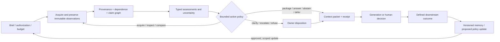

# Theory and prior art: evidence selection before generation

Prepared 2026-08-18 for the Pattern Recognition / Discrimination Layer research agenda.

## Scope and reading basis

This is a bounded, primary-source-oriented synthesis, not a systematic review and not a novelty opinion. I read the repository README, the current thought-piece manuscript, and the existing prior-art/reference materials, then checked the original papers, standards, publisher pages, and official research pages listed below. The project’s own manuscript says that it is a provisional research agenda: it does not yet report an implementation, a controlled evaluation, a validated taxonomy, or a proof that the proposed decomposition is minimal. This report preserves that stance.

The thesis, in compressed form, is that a system should make an explicit, inspectable, cost-bounded, source-aware, correctable decision about what context to acquire, compare, preserve, enrich, admit, withhold, or update before generation or other consequential action. The manuscript calls this responsibility a “discrimination layer,” and decomposes it into an authorization/brief, acquisition control, artifact and provenance spine, relation and claim graphs, multidimensional assessment, enrichment/stopping/router logic, bounded context packet, human disposition, versioned memory, and outcome feedback (C01–C11).

I use the following labels throughout:

- **[S] Sourced evidence:** a claim supported directly by one or more linked primary sources or standards.
- **[I] Inference:** my synthesis from the sources and the project materials. It is not a result reported by a source.
- **[H] Hypothesis/proposal:** a conjecture or testable design recommendation for a future paper.

The source set is intentionally limited to peer-reviewed papers, conference proceedings, authoritative books, formal standards, and official methodology/research pages. I do not treat vendor blogs, marketing pages, or search-result snippets as evidence for scientific novelty. A publisher or author copy is linked where it is the most stable freely accessible version; the DOI is included when one is available.

## Executive synthesis

The central idea is important, but it is not a clean-sheet mechanism. The literature already contains nearly every component in isolation and several strong pairwise combinations:

1. **Information foraging and sensemaking** model search as movement among information patches, with costs, information scent, iterative foraging, evidence marshalling, hypothesis generation, external representations, and stopping/leverage points ([F01], [F02]).
2. **Value of information, metareasoning, influence diagrams, and adaptive acquisition** formalize choosing whether another computation, observation, or search is worth its cost and how to stop ([F03]–[F07]).
3. **Provenance and scientific-evidence semantics** represent entities, activities, agents, derivations, claims, argumentation, source attribution, interpretations, and evidence types ([P01]–[P04], [P09], [P10]).
4. **Claim provenance and evidence-based trustworthiness** directly address claim origin, support/contradiction, correlated or copied sources, and the failure of article-level majority voting ([P05]–[P08]). This is the closest prior art to the manuscript’s common-origin, independence, recurrence, and claim/evidence graph claims.
5. **RAG, browser-assisted QA, self-reflective retrieval, verified quotations, and citation generation** already place retrieval/evidence selection, abstention, and citation support in or immediately before generation ([C02]–[C09]). A claim that “context selection before generation” itself is new would be untenable.
6. **Human–automation research** shows why an owner review/override is not automatically a safeguard: automation can be over-relied upon, neglected, or abused; explanations can increase acceptance without improving complementary performance; cognitive forcing can reduce overreliance while increasing burden ([H01]–[H06]).
7. **Organizational memory and learning** already supply acquisition/retention/retrieval, institutionalization, experience-to-knowledge, exploration/exploitation, and history-dependent routine concepts ([M01]–[M05]). A versioned evidence/decision ledger plus outcome feedback needs to be framed as a particular operationalization, not as the invention of organizational memory.

The strongest real contribution available to this project is therefore an **integrated, domain-general policy contract** that joins these strands at a particular control point: before generation or action, under explicit authorization and budgets, with graph-level source dependence, typed evidence assessments, human disposition, and auditable memory/outcome updates. That is a potentially useful architecture and research program. It is presently a synthesis/design claim, not an established algorithmic novelty claim. The manuscript should not state that prior systems “retrieve but do not discriminate,” or that no existing framework separates these concerns, without a scoped comparison and an operational definition of “separate.”

Three distinctions could make the contribution sharper and testable:

- **Selection is not truth:** a router chooses an action or packet; it does not by itself establish that a claim is true.
- **Lineage is not credibility:** provenance identifies where an artifact/statement came from and how it was transformed; it does not certify correctness.
- **Typed dimensions are not one score:** authority, claim support, independence, relevance, attention priority, action priority, uncertainty, and owner disposition should be represented as different fields/relations with uncertainty and scope, not silently collapsed into a single “evidence quality” number.

The word “discrimination” is a material terminology risk. A bounded terminology audit found no stable, widely recognized technical meaning for the exact phrase in this intended sense; the phrase collides with social/legal discrimination, network/application discrimination, classifier/discriminator layers, and minibatch-discrimination mechanisms. That absence is an inference from a limited search, not proof of non-use. The eventual paper should either rename the layer (for example, **evidence-selection and judgment layer**, **context-judgment layer**, or **evidence-governance layer**) or provide a prominent definition, a non-social-justice disclaimer, and a reader-comprehension test against alternatives.

## What the current thesis should claim—and not claim

The manuscript’s six families and C01–C11 are useful as a design decomposition. The prior-art evidence supports the following conservative statement:

> Existing research provides mature partial frameworks for search/sensemaking, information value, provenance, argumentation, claim verification, retrieval-augmented generation, human–automation reliance, and organizational memory. This project proposes a cross-domain control architecture that composes those ideas around evidence selection and disposition before generation, with explicit source-dependence analysis, authorization, budget, human ownership, and revisable outcome records. The contribution is to be demonstrated as an integrated contract and evaluated against ablations—not assumed from the list of components.

The following stronger statements are not currently supported:

- “No prior system selects evidence before generating.” RAG, WebGPT, Self-RAG, GopherCite, and ALCE directly contradict this.
- “No prior work represents claim/evidence/provenance graphs.” SEE, Micropublications, PROV, ECO, nanopublications, and claim-provenance work directly contradict this.
- “A recurring source count is evidence of independent corroboration.” Claim-provenance and data-fusion work show that copied, syndicated, or common-process sources can inflate apparent consensus.
- “Human review makes the system safe/correctable.” Human–automation studies show reliance, workload, explanation, and performance can move in different directions.
- “A memory ledger necessarily improves future decisions.” Organizational-learning work shows that memory is selective, context-dependent, and capable of institutionalizing error.
- “The six-family decomposition is minimal or validated.” No such result exists in the current materials; it is a design hypothesis.

## Annotated primary-source table

### Search, sensemaking, metareasoning, and information value

| ID | Primary source | [S] What it establishes | Implication and boundary for this project |
|---|---|---|---|
| **F01** | Pirolli & Card, “Information Foraging,” *Psychological Review* 106(4), 1999. [DOI 10.1037/0033-295X.106.4.643](https://doi.org/10.1037/0033-295X.106.4.643) | Search is modeled as adaptive movement through information patches using information scent/gain relative to cost. | Direct precedent for C02’s acquisition controller, cost-bounded search, and source/patch selection. It is a cognitive/behavioral model, not a claim/evidence/provenance schema or truth criterion. |
| **F02** | Pirolli & Card, “The Sensemaking Process and Leverage Points for Analyst Technology,” International Conference on Intelligence Analysis, 2005. [Author/PDF copy](https://andymatuschak.org/files/papers/Pirolli%2C%20Card%20-%202005%20-%20The%20sensemaking%20process%20and%20leverage%20points%20for%20analyst%20technology%20as.pdf) | Describes a foraging loop and a sensemaking loop: search, filter, read/extract, schematize, develop hypotheses, and produce a coherent explanation; identifies problem structuring, evidentiary reasoning, decision-making, external memory, and representation as leverage points. | This is the closest process-level precedent for the manuscript’s acquire–inspect–compare–enrich–package loop. It also supports saying that the contribution is a new control/representation composition, not the discovery of iterative evidence work. |
| **F03** | Howard, “Information Value Theory,” *IEEE Transactions on Systems Science and Cybernetics* 2(1), 1966. [DOI 10.1109/TSSC.1966.300074](https://doi.org/10.1109/TSSC.1966.300074) | Information value depends on probabilities and economic consequences; joint elimination of uncertainty can have value that is not the sum of individual values. | Provides the decision-theoretic foundation for enrichment value, action priority, and stopping. The project must specify whose utility, which consequences, and how uncertainty is estimated; the paper does not solve open-world textual search. |
| **F04** | Russell & Wefald, “Principles of Metareasoning,” *Artificial Intelligence* 49, 1991. [DOI 10.1016/0004-3702(91)90015-C](https://doi.org/10.1016/0004-3702(91)90015-C) | Computational actions can be selected and justified by their expected utility for improving an external action. | Strong prior for a router that chooses “search/compare/clarify/answer/defer,” rather than treating retrieval as an unconditional prelude. A useful formal vocabulary; not a domain-general evidence ontology. |
| **F05** | Kamar & Horvitz, “Light at the End of the Tunnel: A Monte Carlo Approach to Computing Value of Information,” AAMAS 2013, pp. 571–578. [Microsoft Research page](https://www.microsoft.com/en-us/research/publication/light-at-the-end-of-the-tunnel-a-monte-carlo-approach-to-computing-value-of-information/) · [PDF](https://erichorvitz.com/MC-VOI_aamas_2013.pdf) | Monte Carlo VOI estimates whether to stop or collect more information when long sequences of weak observations make exact calculation intractable; evaluated on synthetic and citizen-science data. | Nearly direct prior for C02/C07. The project can contribute by adapting the idea to provenance-rich, claim-level, authorization-constrained packets, but must compare to a VOI/fixed-top-k baseline and not call the controller novel merely because it is described in a new vocabulary. |
| **F06** | Golovin & Krause, “Adaptive Submodularity: Theory and Applications in Active Learning and Stochastic Optimization,” *Journal of Artificial Intelligence Research* 42, 2011. [JAIR page](https://s.aaai.org/Library/JAIR/Vol42/jair42-012.php) · [arXiv record](https://arxiv.org/abs/1003.3967) | Adaptive submodularity gives conditions under which a greedy policy is near-optimal while observations are revealed and choices adapt; examples include active learning and sensor placement. | A possible formal route for diminishing returns and adaptive enrichment. It is not evidence that textual sources satisfy adaptive submodularity; testing/assumption checks are required. |
| **F07** | Howard & Matheson, “Influence Diagrams,” *Decision Analysis* 2(3), 2005. [DOI 10.1287/deca.1050.0020](https://doi.org/10.1287/deca.1050.0020) | Graphical models can represent chance variables, decisions, information states, and utility, including value-of-information reasoning. | Useful ancestor for C01’s decision brief/authorization envelope and C07’s router. The proposed evidence graph should be shown as complementary to, not a replacement for, a decision model. |
| **F08** | Cohn, Atlas & Ladner, “Improving Generalization with Active Learning,” *Machine Learning* 15, 1994. [DOI 10.1007/BF00993277](https://doi.org/10.1007/BF00993277) | Active learning controls which part of a domain receives information and can improve generalization under a fixed labeling budget. | Supports the analogy that acquisition is a choice, but labels in a closed learning problem are not live sources in an open-world evidence problem. Do not use this as direct validation of the proposed evidence router. |

### Provenance, evidence graphs, argumentation, and source dependence

| ID | Primary source | [S] What it establishes | Implication and boundary for this project |
|---|---|---|---|
| **P01** | W3C, “PROV-O: The PROV Ontology,” W3C Recommendation, 2013. [Official standard](https://www.w3.org/TR/prov-o/) | A formal OWL representation of the PROV data model: entities, activities, agents, derivations, specialization, attribution, and temporal/lineage relations. | C03 should explicitly map to, reuse, or contrast with PROV rather than inventing “provenance spine” terminology without a standards comparison. PROV records lineage; it does not certify claim truth, source independence, or decision relevance. |
| **P02** | Moreau et al., “The Rationale of PROV,” *Journal of Web Semantics* 35, 2015. [DOI 10.1016/j.websem.2015.04.001](https://doi.org/10.1016/j.websem.2015.04.001) | Documents requirements, principles, and design decisions behind provenance modeling. | Useful for the paper’s interoperability and provenance-semantics section. The project’s additional claim/decision fields need explicit semantic commitments. |
| **P03** | Bölling, Weidlich & Holzhütter, “SEE: Structured Representation of Scientific Evidence in the Biomedical Domain Using Semantic Web Techniques,” *Journal of Biomedical Semantics* 5(S1):S1, 2014. [DOI 10.1186/2041-1480-5-S1-S1](https://doi.org/10.1186/2041-1480-5-S1-S1) | Represents claims and argumentative structure plus provenance, agents, sources, materials, methods, data, assumptions, and inferences; supports layered interpretations and different evaluations of the same data. | This is one of the closest integrated precedents to C03/C05/C06. It substantially weakens any unqualified “integrated claim–evidence graph is new” claim. A possible contribution is domain-general, live/open-world acquisition and action policy beyond biomedical scientific evidence, but that boundary must be explicit and evaluated. |
| **P04** | Clark, Ciccarese & Goble, “Micropublications: A Semantic Model for Claims, Evidence, Arguments and Annotations in Biomedical Communications,” *Journal of Biomedical Semantics* 5:28, 2014. [DOI 10.1186/2041-1480-5-28](https://doi.org/10.1186/2041-1480-5-28) | Defines machine-tractable statements, data, methods/materials, support/similarity/challenge, and transitive access to evidence and methods, from minimal to richly annotated representations. | Direct prior for claim/evidence/argument graphs and disagreement. The manuscript should cite it and state what its control-plane router, authorization, cost, and human disposition add rather than imply the graph itself is novel. |
| **P05** | Zhang, Ives & Roth, “Who Said It, and Why? Provenance for Natural Language Claims,” ACL 2020. [ACL record](https://aclanthology.org/2020.acl-main.406/) · [PDF](https://aclanthology.org/2020.acl-main.406.pdf) | Builds a claim-provenance graph with source nodes/statements and labeled entailment, paraphrase, contradiction, and motivation edges; adds support/contradiction/neutral evidence labels; shows article-level majority can overcount a common source and that provenance can identify more independent support. | This is the closest direct precedent for C04’s common-origin/recurrence/independence and C05’s claim graph. The project should compare its graph semantics and metrics. The paper’s origin inference is approximate and not a complete acquisition/action controller. |
| **P06** | Zhang, Ives & Roth, “What Is Your Article Based On? Inferring Fine-Grained Provenance,” ACL-IJCNLP 2021. [DOI 10.18653/v1/2021.acl-long.458](https://doi.org/10.18653/v1/2021.acl-long.458) · [ACL record](https://aclanthology.org/2021.acl-long.458/) | Identifies sentences containing external information, generates source-article candidates, and uses an ILP to infer fine-grained source provenance; reports a dedicated Politi-Prov dataset and improved inference. | Shows that “where did this sentence come from?” is a nontrivial modeling and evaluation problem. The project should not assume common origin is observable; provenance confidence and unresolved origin must be first-class. |
| **P07** | Zhang, Ives & Roth, “Evidence-Based Trustworthiness,” ACL 2019. [DOI 10.18653/v1/P19-1040](https://doi.org/10.18653/v1/P19-1040) · [ACL record](https://aclanthology.org/P19-1040/) | Jointly estimates source trustworthiness and claim credibility from noisy evidence; demonstrates that majority view can be wrong. | Strong prior for separating source- and claim-level judgments, while also revealing a potential overlap: a typed multidimensional schema must explain why it is preferable to (or complements) probabilistic latent credibility models. |
| **P08** | Pochampally et al., “Fusing Data with Correlations,” SIGMOD 2014. [DOI 10.1145/2588555.2593674](https://doi.org/10.1145/2588555.2593674) | Models source correlations broader than literal copying, including common extraction rules and complementary/negative correlations; naive fusion can be distorted by correlated sources. | Directly supports an origin/dependence graph, but cautions that binary “independent/dependent” labels are too coarse. Use graded, typed dependence with uncertainty and domain-specific failure modes. |
| **P09** | Chibucos et al., “The Evidence Ontology: Supporting Conclusions & Assertions with Evidence,” *Methods in Molecular Biology* 2017. [DOI 10.1007/978-1-4939-3743-1_18](https://doi.org/10.1007/978-1-4939-3743-1_18) · [PMC](https://pmc.ncbi.nlm.nih.gov/articles/PMC6377151/) | Defines evidence types and distinguishes experimental, computational, author-statement, and curator-inference support, including process actors and quality-control use. | A strong prior for an explicit evidence-type vocabulary and provenance-linked assessment. It is biomedical and ontology-centered, not a live research policy/router. |
| **P10** | Malone et al., “Standardized Description of Scientific Evidence Using the Evidence Ontology (ECO),” *Database* 2014. [DOI 10.1093/database/bau075](https://doi.org/10.1093/database/bau075) · [Oxford record](https://academic.oup.com/database/article/doi/10.1093/database/bau075/2634798) | Reports a controlled vocabulary for evidence supporting assertions, annotation methods, and provenance. | The paper should cite ECO if it uses evidence categories, and decide whether its own categories are compatible, a superset, or deliberately task-specific. |
| **P11** | Groth, Gibson & Velterop, “The Anatomy of a Nanopublication,” *Semantic Web*, 2010. [DOI 10.3233/ISU-2010-0613](https://doi.org/10.3233/ISU-2010-0613) | Uses named graphs to package an assertion with provenance and publication information; motivates machine-readable, attributable units. | Close precedent for a bounded, portable context packet with an assertion/evidence/provenance payload. It does not supply the manuscript’s action policy or owner workflow. |
| **P12** | Toulmin, *The Uses of Argument*, Cambridge University Press, 1958/2003. [Publisher sample](https://assets.cambridge.org/97805218/27485/sample/9780521827485ws.pdf) · ISBN 9780521827485 | Provides the claim/data/warrant/backing/qualifier/rebuttal grammar and emphasizes field-dependent warrants. | If C05 uses “claim,” “support,” “contradiction,” “qualification,” or “warrant,” map the vocabulary to Toulmin or explicitly depart from it. A graph without warrants, scope, and rebuttals can make support look stronger than it is. |

### Claim verification and retrieval before/within generation

| ID | Primary source | [S] What it establishes | Implication and boundary for this project |
|---|---|---|---|
| **C01** | Thorne et al., “FEVER: A Large-Scale Dataset for Fact Extraction and VERification,” NAACL 2018. [DOI 10.18653/v1/N18-1074](https://doi.org/10.18653/v1/N18-1074) · [ACL record](https://aclanthology.org/N18-1074/) | Defines SUPPORTS/REFUTES/NOT ENOUGH INFO with retrieved evidence for claims. | Establishes the bounded claim-verification baseline. It is not an open-world authorization, provenance, memory, or acquisition framework. |
| **C02** | Wadden et al., “SciFact: A Dataset and Benchmark for Scientific Claim Verification,” EMNLP 2020. [DOI 10.18653/v1/2020.emnlp-main.609](https://doi.org/10.18653/v1/2020.emnlp-main.609) · [ACL record](https://aclanthology.org/2020.emnlp-main.609/) | Uses expert-written scientific claims, abstract retrieval, support/refute labels, and rationales. | Useful for a claim/evidence evaluation arm, but domain and claim form are restricted; it does not establish broad decision quality. |
| **C03** | Min et al., “FActScore: Fine-Grained Atomic Evaluation of Factual Precision in Long-Form Text Generation,” EMNLP 2023. [DOI 10.18653/v1/2023.emnlp-main.741](https://doi.org/10.18653/v1/2023.emnlp-main.741) · [ACL record](https://aclanthology.org/2023.emnlp-main.741/) | Decomposes generated text into atomic facts and estimates the fraction supported by a reliable knowledge source. | Supports claim-level coverage metrics. Factual support/citation coverage is not the same as source independence, decision relevance, authorization, or truth under ambiguous evidence. |
| **C04** | Lewis et al., “Retrieval-Augmented Generation for Knowledge-Intensive NLP Tasks,” NeurIPS 2020. [Official proceedings](https://proceedings.neurips.cc/paper/2020/hash/6b493230205f780e1bc26945df7481e5-Abstract.html) · [PDF](https://papers.neurips.cc/paper/2020/file/6b493230205f780e1bc26945df7481e5-Paper.pdf) | Introduces non-parametric external memory retrieved at inference time; identifies provenance and updating as open concerns. | Directly defeats a novelty claim about external context before generation. The project’s possible addition is a richer decision/provenance/control contract, not retrieval itself. |
| **C05** | Asai et al., “Self-RAG: Learning to Retrieve, Generate, and Critique through Self-Reflection,” ICLR 2024. [Official IBM research page](https://research.ibm.com/publications/self-rag-learning-to-retrieve-generate-and-critique-through-self-reflection) · [ICLR paper](https://proceedings.iclr.cc/paper_files/paper/2024/file/25f7be9694d7b32d5cc670927b8091e1-Paper-Conference.pdf) | Learns to retrieve on demand and to critique retrieved passages and generated text; motivates adaptive rather than fixed-k retrieval. | Close algorithmic prior for C02/C07. It does not model authorization envelopes, common-origin topology, owner dispositions, or cross-task evidence memory, giving the project a concrete baseline and boundary. |
| **C06** | Nakano et al., “WebGPT: Browser-Assisted Question-Answering with Human Feedback,” 2021. [OpenAI research page](https://openai.com/index/webgpt/) · [paper](https://arxiv.org/abs/2112.09332) · [PDF](https://cdn.openai.com/WebGPT.pdf) | Trains a model to search and navigate the web, collect references, and answer with citations under human feedback. | Direct precedent for search, selection, and references immediately before generation. Use it as a strong pre-generation baseline; do not treat its citation behavior as a full provenance/decision audit. |
| **C07** | Menick et al., “Teaching Language Models to Support Answers with Verified Quotes,” 2022 (GopherCite). [DeepMind research page](https://deepmind.google/blog/gophercite-teaching-language-models-to-support-answers-with-verified-quotes/) · [paper](https://arxiv.org/abs/2203.11147) | Searches documents, answers with supporting quotes, and can abstain when uncertain; demonstrates that citation/quote support and truthfulness are distinct concerns. | Strong prior for C08’s selected spans, abstention, and evidence packet. The project should measure whether its packet improves decision outcomes beyond quote/citation support. |
| **C08** | Gao et al., “Enabling Large Language Models to Generate Text with Citations,” EMNLP 2023 (ALCE). [DOI 10.18653/v1/2023.emnlp-main.398](https://doi.org/10.18653/v1/2023.emnlp-main.398) · [ACL record](https://aclanthology.org/2023.emnlp-main.398/) | Evaluates end-to-end retrieval plus cited generation using fluency, answer correctness, and citation quality; even strong systems leave incomplete support. | Provides a direct evaluation precedent for C08. Citation correctness/coverage should be a secondary measure, not the project’s central success criterion. |
| **C09** | Liu et al., “Lost in the Middle: How Language Models Use Long Contexts,” *Transactions of the ACL*, 2024. [ACL record](https://aclanthology.org/2024.tacl-1.9/) | Shows that model use of relevant information can depend strongly on context length and position. | Supports testing packet ordering, compression, inclusion/exclusion, and “bounded” context as empirical hypotheses. It does not prove a particular packet schema works. |

### Human–automation judgment and cognitive forcing

| ID | Primary source | [S] What it establishes | Implication and boundary for this project |
|---|---|---|---|
| **H01** | Parasuraman & Riley, “Humans and Automation: Use, Misuse, Disuse, Abuse,” *Human Factors* 39(2), 1997. [DOI 10.1518/001872097778543886](https://doi.org/10.1518/001872097778543886) | Distinguishes overreliance/misuse, neglect/disuse, and designer/manager automation abuse; reliance depends on reliability, workload, salience, and context. | C09 should define owner disposition and monitor appropriate reliance rather than assume a human in the loop is a safety property. |
| **H02** | Lee & See, “Trust in Automation: Designing for Appropriate Reliance,” *Human Factors* 46(1), 2004. [DOI 10.1518/hfes.46.1.50_30392](https://doi.org/10.1518/hfes.46.1.50_30392) | Trust should be calibrated to automation capabilities and context; increasing trust is not the objective. | Use “appropriate reliance” and calibration, not “trust” or “human oversight” as unqualified outcomes. |
| **H03** | Amershi et al., “Guidelines for Human-AI Interaction,” CHI 2019. [DOI 10.1145/3290605.3300233](https://doi.org/10.1145/3290605.3300233) | Reports 18 interaction guidelines, developed/validated with practitioners and products. | Useful design prior for C09 receipts, feedback, correction, and handoff. Guidelines are not evidence that this particular architecture improves outcomes. |
| **H04** | Buçinca, Malaya & Gajos, “To Trust or to Think: Cognitive Forcing Functions Can Reduce Overreliance on AI in AI-Assisted Decision-Making,” *PACMHCI* 5(CSCW1), 2021. [DOI 10.1145/3449287](https://doi.org/10.1145/3449287) · [Paper](https://www.eecs.harvard.edu/~kgajos/papers/2021/bucinca21trust.pdf) | In a study of 199 participants, cognitive forcing reduced overreliance relative to simple explanations, but had lower subjective ratings; effects varied with Need for Cognition. | Human review/disposition needs a tested forcing intervention, workload and equity measures, and an explicit failure mode where review becomes ceremonial or is bypassed. |
| **H05** | Bansal et al., “Does the Whole Exceed its Parts? The Effect of AI Explanations on Complementary Team Performance,” CHI 2021. [DOI 10.1145/3411764.3445717](https://doi.org/10.1145/3411764.3445717) · [Author/PDF](https://aiweb.cs.washington.edu/ai/pubs/bansal-chi21.pdf) | Across three datasets, explanations increased acceptance but did not reliably improve complementary human–AI performance. | An audit trail or explanation can be persuasive without being useful. Evaluate decision accuracy, error detection, correction time, and calibration separately from explanation satisfaction. |
| **H06** | Zhang, Liao & Bellamy, “Effect of Confidence and Explanation on Accuracy and Trust Calibration in AI-Assisted Decision Making,” FAccT 2020. [DOI 10.1145/3351095.3372852](https://doi.org/10.1145/3351095.3372852) · [IBM page](https://research.ibm.com/publications/effect-of-confidence-and-explanation-on-accuracy-and-trust-calibration-in-ai-assisted-decision-making) | Confidence information can affect calibration, but trust calibration alone did not guarantee improved joint performance; local explanations had limitations. | Keep evidence confidence, human trust, and outcome performance as separate metrics. |
| **H07** | Croskerry, “Cognitive Forcing Strategies in Clinical Decisionmaking,” *Academic Emergency Medicine*. [DOI 10.1067/mem.2003.22](https://doi.org/10.1067/mem.2003.22) | Describes deliberate strategies to interrupt predictable diagnostic biases. | A conceptual antecedent for contradiction prompts, second-look checks, and forced disposition. The transfer from clinical diagnosis to evidence operations is a hypothesis, not direct validation. |

### Organizational memory and learning

| ID | Primary source | [S] What it establishes | Implication and boundary for this project |
|---|---|---|---|
| **M01** | Walsh & Ungson, “Organizational Memory,” *Academy of Management Review* 16(1), 1991. [DOI 10.5465/AMR.1991.4278992](https://doi.org/10.5465/AMR.1991.4278992) | Defines organizational memory through acquisition, retention, and retrieval and analyzes its use, misuse, and abuse. | Direct foundation for C10’s memory ledger. The paper should ask which provenance, context, and authorization metadata survive retention/retrieval, not treat memory as a neutral archive. |
| **M02** | Crossan, Lane & White, “An Organizational Learning Framework: From Intuition to Institution,” *Academy of Management Review* 24(3), 1999. [DOI 10.5465/amr.1999.2202135](https://doi.org/10.5465/amr.1999.2202135) | Models intuiting, interpreting, integrating, and institutionalizing across individual, group, and organizational levels. | Useful structure for C11’s outcome feedback and policy update. It also warns that a local observation does not automatically justify an institutional rule. |
| **M03** | Argote & Miron-Spektor, “Organizational Learning: From Experience to Knowledge,” *Organization Science* 22(5), 2011. [DOI 10.1287/orsc.1100.0621](https://doi.org/10.1287/orsc.1100.0621) | Experience becomes knowledge through interaction with context; knowledge can be transferred, retained, and transformed. | Supports context-linked outcome records and cautions against generalizing from decontextualized outcomes. |
| **M04** | March, “Exploration and Exploitation in Organizational Learning,” *Organization Science* 2(1), 1991. [DOI 10.1287/orsc.2.1.71](https://doi.org/10.1287/orsc.2.1.71) | Formalizes exploration/exploitation tension and the risk that short-term exploitation undermines long-term adaptation. | A policy that reuses high-yield sources can become blind to peripheral or novel evidence. Add exploration and novelty/missingness monitoring to C02/C11. |
| **M05** | Levitt & March, “Organizational Learning,” *Annual Review of Sociology* 14, 1988. [DOI 10.1146/annurev.so.14.080188.001535](https://doi.org/10.1146/annurev.so.14.080188.001535) | Treats learning as routine-based, history-dependent, and target-oriented; organizations encode inferences from history into routines. | A feedback loop can encode an error as policy. Require explicit update proposals, review, provenance, and rollback rather than silent adaptation. |

### Epistemic vigilance and evidence-synthesis practice

| ID | Primary source | [S] What it establishes | Implication and boundary for this project |
|---|---|---|---|
| **E01** | Sperber et al., “Epistemic Vigilance,” *Mind & Language* 25, 2010. [DOI 10.1111/j.1468-0017.2010.01394.x](https://doi.org/10.1111/j.1468-0017.2010.01394.x) · [Author/PDF](https://www.dan.sperber.fr/wp-content/uploads/EpistemicVigilance.pdf) | Human communication involves assessing both communicated content and communicator/source reliability. | Provides a cognitive rationale for keeping source-level and claim-level assessments distinct. It is a theory of human communication, not a validated implementation for the proposed graph. |
| **E02** | Metzger, “Making Sense of Credibility on the Web,” *Journal of the American Society for Information Science and Technology* 58(13), 2007. [DOI 10.1002/asi.20672](https://doi.org/10.1002/asi.20672) | Web credibility is contextual and multidimensional; source cues interact with content and user goals. | Supports the manuscript’s warning that authority, relevance, and support should not be collapsed. It also cautions that a fixed source hierarchy will be brittle. |
| **R01** | Cochrane, *Cochrane Handbook for Systematic Reviews of Interventions*, current Chapter 4, “Searching for and selecting studies,” updated 2025. [Official chapter](https://www.cochrane.org/authors/handbooks-and-manuals/handbook/current/chapter-04) | Treats studies, not reports, as the unit; groups multiple reports from one study; emphasizes high-sensitivity search, peer review, protocolized strategies, explicit stopping, and handling missing/unknown reports. | A highly practical methodological precedent for common-origin grouping, search stopping, duplicate reporting, inclusion/exclusion logs, and missingness. It is a review standard, not a general AI architecture. |
| **R02** | Page et al., “The PRISMA 2020 Statement,” *BMJ* 372:n71, 2021. [Official article](https://www.bmj.com/content/372/bmj.n71.long) | Specifies transparent reporting of search, screening, inclusion, exclusions, and synthesis for systematic reviews. | Use as a reporting/audit precedent if the project conducts its own prior-art review or evidence synthesis. PRISMA is not a truth algorithm and should not be presented as one. |

## Closest integrated frameworks and what they do not cover

### 1. SEE and Micropublications: closest semantic integration

SEE [P03] and Micropublications [P04] are the strongest direct challenge to a novelty narrative centered on an “evidence graph.” Both join claims/statements to data, methods, arguments, support/challenge, annotations, agents, and provenance. SEE explicitly allows successive interpretation/attribution layers and separate evaluations of the same data; Micropublications support transitive traversal from a claim to evidence and methods. These are not superficial keyword overlaps: they cover the semantic move from a document to an inspectable argument/evidence structure.

[I1] The project can still have a meaningful contribution if it scopes the difference precisely: SEE/Micropublications are primarily representations for biomedical/scientific communication, whereas the proposed layer is a **decision/control plane** for live, open-world, cost-bounded acquisition and packaging before generation, with authorization, source-dependence reasoning, owner disposition, and outcome-governed memory. That is a systems-integration claim. It is not evidence that the graph primitives are new.

### 2. Claim provenance and correlated-source fusion: closest to common-origin reasoning

Zhang, Ives, and Roth [P05], [P06], [P07] provide the most direct precedent for common origin, propagation, claim support/contradiction, and source/claim credibility. Their results specifically undermine document-count corroboration: many articles can be descendants of one source, and article-level majority can be wrong. Pochampally et al. [P08] extend the warning beyond literal copying to correlated extraction processes and complementary source relationships.

[I2] C04 should therefore be framed not as “we introduce recurrence/common origin,” but as “we operationalize provenance-aware dependence as a routing input alongside authorization, relevance, consequence, and VOI.” The empirical question is whether a particular dependence-aware router improves decisions under realistic copied/syndicated/common-process source graphs without suppressing valid independent convergence.

### 3. RAG, WebGPT, Self-RAG, GopherCite, and ALCE: closest to pre-generation selection

RAG [C04] makes external memory available at inference; WebGPT [C06] searches and navigates before answering; GopherCite [C07] retrieves and quotes support while abstaining; Self-RAG [C05] learns when to retrieve and critique; ALCE [C08] evaluates cited generation. These works establish that “retrieve, select, use, and cite external evidence before/during generation” is an active research line.

[I3] The project’s differentiator cannot be retrieval timing. It must be the **typed control contract** around retrieval: what the system was authorized to use; which source/artifact/claim relations are known or unknown; why an item was included or excluded; what stopping rule was applied; which owner accepted/overrode/deferred; and how later outcomes revise policy. Those elements need an ablation, not just an architecture diagram.

### 4. Information foraging plus VOI/metareasoning: closest to acquisition control

Pirolli & Card [F01], [F02], Howard [F03], Russell & Wefald [F04], Kamar & Horvitz [F05], Golovin & Krause [F06], and influence diagrams [F07] offer a substantial theory of selecting information/computation under cost and utility. The project’s acquisition controller and enrichment/stopping loop fit naturally within this family.

[I4] A new name for the loop is not enough. A stronger paper would specify (a) the action space, (b) the decision utility and consequence model, (c) the observable and latent variables, (d) the update rule, (e) the stop/abstain criterion, and (f) the conditions under which greedy/adaptive policies are valid. If the project deliberately avoids probabilities, it should state that it is a qualitative policy/ledger design and evaluate it accordingly rather than borrowing VOI language loosely.

### 5. PROV, ECO, and nanopublications: closest to the audit substrate

PROV-O [P01]–[P02] supplies a standard lineage vocabulary; ECO [P09]–[P10] supplies typed evidence categories; nanopublications [P11] package assertions with provenance and publication information. Together they show that an inspectable artifact/evidence spine is an established interoperability problem.

[I5] The paper should define the project’s relation to PROV: reuse, profile, extension, or incompatible alternative. “Provenance” should be reserved for lineage/derivation/attribution. Support, contradiction, reliability, relevance, action value, authorization, and disposition are additional relations that should not be implied by a PROV edge.

### 6. Human factors and organizational memory: closest to the governance loop

Human–automation research [H01]–[H06] supplies the risks and intervention vocabulary for C09; organizational memory/learning [M01]–[M05] supplies the acquisition–retention–retrieval–institutionalization vocabulary for C10/C11.

[I6] These strands make the governance pieces indispensable but also prevent easy safety claims. A “human owner” can be overloaded, can defer to a convincing packet, or can institutionalize a wrong update. The architecture needs a measurable human-factors contract (appropriate reliance, correction, workload, and override quality) and an explicit rollback/uncertainty contract for memory.

## Novelty audit

The judgments below are scoped to the sources above. “Partial precedent” means the element exists in a neighboring domain or a different level of abstraction. “Integration opportunity” means a plausible contribution, not an established novelty result.

| Manuscript claim or design element | Prior-art status | Safe formulation now | What would make a stronger contribution |
|---|---|---|---|
| Context is selected before generation/action | **Established** by information foraging, WebGPT, RAG, Self-RAG, GopherCite, and ALCE. | “We study a policy-governed form of pre-generation evidence selection.” | Compare against fixed top-k, strong adaptive retrieval, and browser-assisted/citation baselines under matched cost. |
| Search is iterative and should stop when further work is not worth its cost | **Established** by sensemaking, VOI, metareasoning, and systematic-review methods. | “We instantiate an evidence-domain stopping policy.” | Define a utility/consequence model and test stop-vs-collect regret, not just search length. |
| Claims, evidence, arguments, contradiction, and provenance form a graph | **Established/strong partial precedent** in SEE, Micropublications, Toulmin, PROV, ECO, nanopublications, and claim-provenance work. | “We profile these representations into a pre-generation control plane.” | Provide a formal schema mapping and an ablation showing which relation types affect decisions. |
| Recurrence is not independence; common origin can inflate consensus | **Established** directly by claim provenance and correlated-source fusion. | “We operationalize origin/dependence as a routing feature.” | Release a provenance-rich benchmark with copied, syndicated, common-process, and independent evidence; measure false-corroboration and valid-consensus loss. |
| Source authority, claim support, independence, relevance, attention, and action priority should be separate | **Partial precedent.** Source/claim trust models, epistemic vigilance, ECO, and credibility research support separation, but not necessarily this exact typed set. | “We propose a typed, non-collapsing assessment contract.” | Demonstrate discriminant validity, inter-rater reliability, incremental predictive value, and calibration versus one-score credibility models. |
| Authorization/decision brief should constrain acquisition | **Partial/adjacent precedent** in influence diagrams, decision analysis, provenance/access control, and evidence synthesis protocols. | “We make authorization and decision scope explicit in the evidence policy.” | Show that authorization-aware routing prevents out-of-scope evidence and improves decision utility under realistic constraints. |
| Context packet should contain selected spans, provenance, links, exclusions, unknowns, and budget | **Partial/strong precedent** in nanopublications, GopherCite, ALCE, RAG citations, systematic-review logs, and provenance systems. | “We specify a bounded packet/receipt with decision and omission semantics.” | Measure correction time, unsupported claims, missing counterevidence, and downstream performance against citation-only packets. |
| A human owner should disposition/override/hold/escalate | **Established design concern, unproven effect.** Human–automation literature supports appropriate reliance and forcing functions. | “We require an explicit owner decision and test its effect.” | Randomize forcing/receipt variants; measure appropriate reliance, override quality, workload, time, and subgroup effects. |
| Versioned memory plus outcome feedback should revise policy | **Established conceptual precedent** in organizational memory/learning; implementation is open. | “We operationalize context-linked, provenance-preserving policy updates.” | Compare governed, provenance-linked updates to naive memory/retraining; test stale-error propagation, rollback, and exploration. |
| Six families/C01–C11 are a complete/minimal architecture | **Unsupported.** The current materials provide no empirical or formal minimality result. | “We propose a working decomposition.” | Conduct expert card sorting/Delphi or formal coverage analysis; report missing/merged constructs and negative cases. |
| “Discrimination layer” is the right name | **Unvalidated and collision-prone.** Bounded terminology audit found no stable intended use. | “We provisionally call this an evidence-selection and judgment layer.” | Test comprehension, connotation, and retrieval collision against at least three alternative names; rename if confusion is material. |
| The architecture is safer/more trustworthy/correct | **Unsupported outcome claim.** Human explanations can increase acceptance without performance; provenance can be wrong or incomplete; memory can amplify errors. | “The architecture exposes testable mechanisms for auditability and correction.” | Pre-register outcome, calibration, error, and cost measures; include failure and no-effect results as valid. |

### Real versus overstated novelty

[I7] The most defensible novelty claim is a **composition and operational contract**, not a new primitive. Specifically, the project may contribute a cross-domain policy that keeps the following connected but non-equivalent:

1. the authorized decision/question and budget;
2. immutable observations and artifact lineage;
3. source dependence/common-origin topology;
4. claim/evidence/argument support and contradiction;
5. typed assessments with uncertainty and possible consequence;
6. an action/stop/abstain router;
7. a bounded packet with inclusion/exclusion/stopping receipt;
8. an accountable owner disposition; and
9. versioned, context-linked outcomes that can propose—not silently enact—policy changes.

That combination is plausible and useful, but “no single prior system combines all nine” is not yet demonstrated. It requires a systematic search and a comparison matrix with inclusion criteria. Even if no exact predecessor is found, the result should be described as a design-science or architecture contribution unless a new algorithm, theorem, dataset, or controlled effect is supplied.

[I8] The likely overstatement is treating integration as self-validating. Prior systems already integrate several neighboring pieces; an architecture can be more elaborate without being more accurate, more efficient, or more correctable. The project’s proof burden is therefore comparative: show that the typed contract gives an outcome or governance benefit that simpler combinations do not, under equal resources.

## Proposed conceptual model for a future paper

### Typed state, graph, and policy

I recommend formalizing the proposed layer as a **policy over a typed evidence-and-decision state**, rather than as a seventh kind of “truth score.” Let the state at step (t) be:

\[
X_t = (B_t, O_t, G^P_t, G^C_t, A_t, M_t, Y_t),
\]

where:

- (B_t) is the decision brief: question, authorized sources/actions, owner, deadline, risk class, budget, and required output form;
- (O_t) is the immutable observation/artifact store: raw capture, normalized representation, exact spans, timestamps, hashes, transformations, and acquisition receipts;
- (G^P_t) is a provenance/dependence graph over artifacts, sources, activities, agents, derivations, quotations, revisions, and possible common origins;
- (G^C_t) is a claim/evidence/argument graph: atomic claim, scope, evidence span, support/refute/qualify/challenge, warrant or inference, contradiction, and unresolved relation;
- (A_t) is a typed assessment relation, with separate values and uncertainty for authority, claim support, independence/dependence, relevance to (B_t), attention priority, enrichment value, action priority, possible consequence, and owner disposition;
- (M_t) is versioned memory of packets, decisions, dispositions, policy versions, and context-specific outcomes; and
- (Y_t) is the observed downstream outcome, with its measurement definition, time window, exposure, and confounders.

The policy chooses an **action**, not a truth label:

\[
a_t \in \{\text{acquire, inspect, compare, enrich, clarify, package, answer, provisional, abstain, defer, escalate, refuse}\}.
\]

The action policy is (π(a_t \mid X_t, B_t)), subject to authorization and budget constraints. A simplified expected-value expression can guide implementation:

\[
\operatorname{EVSI}(a) =
E[U(d^*(X_{t+1})) \mid a] - U(d^*(X_t)) - C(a),
\]

where (d^*) is the best available downstream decision, (U) is the explicitly scoped utility/consequence function, and (C(a)) includes time, money, tokens, opportunity cost, exposure, and review burden. This is a design scaffold—not a claim that open-world textual evidence has calibrated probabilities or that utility is easy to specify. If the implementation cannot estimate these terms, it should call the result a qualitative policy/ledger and state the approximation.

### Representation contract

The following typed edges would make the project’s distinctions executable:

| Relation | Meaning | Must not imply |
|---|---|---|
| `derived_from`, `quoted_from`, `revision_of`, `attributed_to`, `generated_by` | Lineage/attribution/transformation (PROV-like) | Truth, authority, or independence |
| `supports`, `refutes`, `qualifies`, `challenges`, `entails` | Claim/evidence or claim/claim relation, with scope and confidence | That the source is authoritative or independent |
| `same_origin_as`, `copied_from`, `syndicated_from`, `common_process_as`, `independent_of`, `unknown_dependence` | Source/dependence hypothesis with provenance and uncertainty | A binary fact when origin is unresolved |
| `authoritative_for` | Source’s bounded institutional/domain authority for a proposition class/time | Support for this particular claim or universal correctness |
| `relevant_to`, `attention_priority`, `action_priority`, `enrichment_value` | Relation to the current brief and action | Factual credibility |
| `included_in`, `excluded_from`, `held_for`, `deferred_to`, `overridden_by` | Packet/owner disposition with actor, time, and rationale | Final truth or permanent exclusion |
| `outcome_of`, `policy_update_proposed_by`, `supersedes`, `rollback_of` | Context-linked feedback and version relation | Causal proof from one outcome |

The packet (P_t) should be a reproducible projection of this state, containing exact evidence spans/IDs, source and artifact lineage, claim links, dependence status, counterevidence, unknowns, inclusion/exclusion decisions, stopping reason, authorization/budget, packet version, owner disposition, and a hash or equivalent integrity reference. A citation list alone is not a packet. A packet can be well-provenanced and still wrong.

### Small process diagram

[I9] The key architectural claim is that the feedback arrow must not silently rewrite (G^P), (G^C), or a past packet. It can propose a new policy or assessment calibration while preserving the historical record. That is the practical form of “revisable” that can be audited.

## Falsifiable propositions and evaluation plan

The following are hypotheses, not findings. They are deliberately written so that a null or negative result is possible.

| ID | [H] Falsifiable proposition | Operational test and falsifier |
|---|---|---|
| **H1 — typed discriminant validity** | Trained reviewers can reliably distinguish authority, claim support, dependence/independence, relevance, attention priority, and action priority when each is defined with examples. | Blindly rate the same evidence in randomized cases; preregister Krippendorff’s α/ICC targets and factor/cluster structure. Falsified if ratings collapse into one factor, remain below the threshold, or add no predictive value over one quality score. |
| **H2 — origin-aware corroboration** | A provenance/dependence graph reduces false corroboration relative to document-count, citation-only, and text-similarity baselines, without materially suppressing valid independent convergence. | Build a benchmark with original reports, copies, paraphrases, syndication, common extraction processes, and genuinely independent sources; measure false-corroboration rate, valid-consensus recall, calibration, and abstention. Falsified if graph routing does not beat baselines or loses more valid convergence than its false-corroboration reduction warrants. |
| **H3 — adaptive acquisition value** | Under a fixed time/token/money budget, a VOI- or consequence-aware router produces higher decision-relevant supported-claim utility or lower regret than fixed top-k and strong adaptive-retrieval baselines. | Matched-budget randomized tasks with known decision utility and hidden counterevidence; evaluate supported-claim yield, decision regret, cost, and stop/continue calibration. Falsified by a tie or worse performance after accounting for metadata and review cost. |
| **H4 — packet/receipt benefit** | A bounded packet containing spans, provenance, dependence status, exclusions, unknowns, and stopping reason improves correction time and appropriate abstention over citations-only or raw-context packets. | Double-blind human correction tasks; measure unsupported claims, missed counterevidence, correction time, abstention calibration, workload, and output quality. Falsified if the richer packet adds burden without improvement or increases unwarranted acceptance. |
| **H5 — owner disposition benefit** | Explicit owner disposition plus a tested cognitive-forcing prompt reduces automation bias and improves error detection relative to passive review, without unacceptable workload or subgroup harm. | Randomize passive receipt, explanation-only, and forcing/owner-disposition conditions; measure reliance conditional on system correctness, overrides, error detection, time, NASA-TLX-like workload, and subgroup effects. Falsified if forcing does not reduce overreliance, or its cost/equity harms exceed its gains. |
| **H6 — provenance-preserving memory** | Context-linked, origin-preserving memory reduces stale/error propagation during reuse compared with naive summary memory or retrieval-only reuse. | Seed controlled stale/copy/contradiction cases, then run multi-round reuse; measure origin retention, stale reuse, correction/rollback success, and valid novel evidence discovery. Falsified if memory lineage does not improve these metrics or suppresses exploration. |
| **H7 — governed outcome feedback** | Versioned, pre-specified outcome feedback improves calibration or decision utility only when outcome scope, exposure, time window, and confounders are logged. | Compare governed feedback, outcome-only feedback, and no-feedback policies across repeated tasks; measure calibration, policy drift, rollback, and exploration/exploitation. Falsified if outcome-only feedback performs as well or if governed updates do not prevent spurious adaptation. |
| **H8 — terminology comprehension** | Readers interpret “discrimination layer” as technical evidence selection rather than social/legal discrimination or model classification, at least as well as an alternative label. | Randomized comprehension/connotation test with “discrimination layer,” “evidence-selection and judgment layer,” “context-judgment layer,” and “evidence-governance layer.” Falsified if intended meaning is misidentified or the term causes material negative connotation/confusion. |

### Recommended experiment design

1. **Use a provenance-rich task set, not only FEVER/SciFact.** FEVER and SciFact are useful bounded claim-verification components, but the full thesis needs source copies, paraphrases, common-origin reports, independent convergence, source authority conflicts, temporal revisions, missing observations, authorization boundaries, and consequences. A synthetic provenance-controlled benchmark can provide ground truth for dependence and policy violations; a small expert-curated open-world set can test ecological validity.
2. **Compare against strong simple baselines.** At minimum: ordinary search plus manual citation; fixed top-k RAG; adaptive retrieval/Self-RAG-like baseline; citation/quote packet; provenance-only graph; claim-only graph; one-score credibility model; and full typed policy. Include ablations for origin graph, VOI/stopping, owner disposition, and memory feedback.
3. **Match resources.** Equalize retrieval calls, tokens, time, API/provider budget, and human review time. Otherwise the full architecture can win by spending more.
4. **Predefine the decision and consequences.** “Factuality,” citation coverage, and fluency are useful secondary measures. Primary measures should be task utility, regret, appropriate abstention, correction, missed counterevidence, and cost. The utility function and stop threshold should be declared before observing outcomes.
5. **Separate provenance correctness from claim correctness.** Score origin/lineage extraction, support/contradiction classification, action selection, and downstream generation/decision independently. A system can be right for the wrong reason or traceable but wrong.
6. **Include human factors and negative controls.** Test whether reviewers read the packet, understand exclusions, and can recover from a bad recommendation. Include a receipt-only control to detect architecture theater and a forced-extra-search control to detect whether “adaptive” merely spends more.
7. **Treat feedback as an intervention.** Log exposure, decision context, time window, outcome definition, missing outcomes, and policy version. Use holdout tasks and rollback tests to detect self-reinforcing error.

## Contradictions, limits, and failure modes

### Dependence is not a simple discount

[S] Claim provenance and correlated-source fusion show that common origin and source correlations can inflate apparent support [P05]–[P08]. [I10] But a universal penalty for recurrence is also wrong: independent sources can converge because the proposition is true, and a copied source can preserve a correct observation. The graph should express a dependence hypothesis with type, confidence, scope, and direction—not replace evidence judgment with a “discount duplicates” heuristic. Evaluate both false-corroboration reduction and valid-consensus loss.

### Provenance can be incomplete, manipulated, or wrong

[S] PROV describes lineage semantics [P01]–[P02], while fine-grained claim provenance inference remains a research problem [P05]–[P06]. [I11] “Inspectable” should mean inspectable with uncertainty and provenance gaps visible, not complete or tamper-proof. Include unknown-origin and disputed-origin states, and do not make an unverified provenance edge a prerequisite for all use; otherwise the system can become over-conservative or exploitable.

### Authority, support, relevance, and consequence can conflict

[S] Web credibility and epistemic-vigilance research treat credibility as contextual and multidimensional [E01]–[E02]; evidence ontologies distinguish evidence types [P09]–[P10]. [I12] A narrow first-party source can be authoritative for a policy but not support a claim about outcomes; a low-authority observation can be highly relevant as a warning; a highly relevant claim can have low action consequence. The schema should retain the conflict and expose the reason for routing rather than produce a single “quality” score.

### VOI requires a decision model that may not exist

[S] Information value and metareasoning require probabilities/utilities or approximations [F03]–[F07]. [I13] In open-world research, the system often does not know the hypothesis space, source reliability, or consequence function. Calling every heuristic “VOI” risks mathematical overclaiming. Use exact/estimated VOI where inputs are defensible; otherwise name a qualitative prioritization or policy rule and test it empirically.

### Search for faint signals conflicts with noise control

[S] Pirolli & Card describe experts lowering filters to catch faint signals while rejecting noise quickly [F02]; March describes exploration/exploitation tension [M04]. [I14] A source-authority or relevance gate can remove weak but important evidence. Add an exploration route, random/novelty sampling, or periodic broad search, and measure what the gate misses. “High precision” is not universally safer than “high recall.”

### More structure can create review theater

[S] Human–automation studies show that explanations can increase acceptance without improving team performance, while forcing can reduce overreliance at a burden [H04]–[H06]. [I15] A large packet, graph, or receipt can make a decision look accountable while no owner meaningfully reviews it. Log receipt opening, evidence-span inspection, correction behavior, and time—not just the presence of a human or explanation field.

### Memory can institutionalize error

[S] Organizational memory/learning is history-dependent and context-sensitive [M01]–[M05]. [I16] A successful-looking outcome can reflect luck, selection, or a hidden confounder; a policy update can lock in a copied error. Require explicit update proposals, scope, evidence, confidence, exposure, review, rollback, and an exploration budget. Preserve old packets and policy versions.

### Bounded packets can lose qualifiers and counterevidence

[S] Toulmin’s warrants/qualifiers/rebuttals matter to argument structure [P12]; long-context behavior is sensitive to placement [C09]. [I17] Selection and compression can omit the condition that makes a claim valid or move a rebuttal out of attention. Packets should include claim scope, qualifier, counterevidence, unresolved issues, and inclusion/exclusion reasons; evaluate position/order and omission failures explicitly.

### “Unknown” is not “not enough evidence,” and absence is not nonexistence

[I18] The project’s own boundary rules are sound and should be formalized: missing observation, inaccessible source, unresolved origin, and explicit negative evidence are different states. FEVER’s NOT ENOUGH INFO [C01] is a useful bounded label, but an open-world router needs reasons for “unknown” and an action policy for whether to search, clarify, abstain, or defer.

### Domain portability is unproven

[S] SEE/ECO are biomedical/scientific; Cochrane is clinical evidence synthesis; WebGPT/RAG operate on web/text tasks; human factors often use structured decision tasks. [I19] A general schema may become too abstract to be useful or may hide domain-specific authority and consequence semantics. Choose a target domain for the first evaluation, expose which fields are domain profiles, and report portability as a separate question.

## Terminology audit: “discrimination layer”

The phrase has rhetorical force, but it creates avoidable risks:

- **Social/legal reading:** “discrimination” commonly denotes unequal treatment or protected-class harm. A reader may interpret the paper as a fairness/classification proposal, even though the manuscript means epistemic selection.
- **Machine-learning reading:** “discriminator” and “discrimination layer” can suggest a classifier, GAN discriminator, adversarial discriminator, or minibatch-discrimination mechanism.
- **Network/systems reading:** “application discrimination” and traffic discrimination suggest traffic shaping or protocol policy.
- **Ordinary-language reading:** “discrimination” can mean discernment, but that sense is less stable in a technical title than “selection,” “judgment,” or “governance.”

[I20] A bounded web/literature terminology check did not reveal a stable cross-disciplinary use of this exact phrase for the intended pre-generation evidence function. This is not a proof of absence and should not be written as a literature result. It is a communication-risk signal.

Recommended names to test:

1. **Evidence-Selection and Judgment Layer** — clearest functional description; somewhat long.
2. **Context-Judgment Layer** — compact, but “context” can mean window/context length rather than evidence governance.
3. **Evidence-Governance Layer** — communicates authorization, audit, disposition, and memory; may understate active search.
4. **Pre-Generation Evidence Policy** — precise for the first paper; does not cover downstream memory/organizational feedback.
5. **Context Admission and Disposition Layer** — explicit about inclusion/exclusion/owner action; less elegant.

If the project retains “discrimination layer,” put the definition in the title/abstract, state that it is not social classification or protected-class discrimination, and test reader comprehension (H8). Avoid using “discriminate” as a verb for choosing sources; prefer “select,” “admit,” “withhold,” “rank,” or “disposition.”

## Concrete changes recommended for an eventual research paper

1. **Reframe the contribution.** Replace broad novelty language with a scoped claim: a domain-general, authorization- and budget-aware control contract for provenance-rich evidence selection and disposition before generation/action. State explicitly that the graph, VOI, RAG, human-review, and organizational-memory components have prior art.
2. **Add the closest missing citations.** At minimum add SEE [P03], Micropublications [P04], Zhang et al. claim provenance [P05]–[P07], Pochampally correlations [P08], PROV-O [P01], ECO [P09]–[P10], Kamar & Horvitz [F05], Golovin & Krause [F06], Walsh & Ungson [M01], Lee & See [H02], Parasuraman & Riley [H01], Buçinca [H04], Bansal [H05], ALCE [C08], Self-RAG [C05], WebGPT [C06], GopherCite [C07], and Cochrane Chapter 4 [R01].
3. **Publish a prior-art comparison matrix.** For each neighboring system, mark whether it has: decision brief, authorization, source/artifact provenance, dependence graph, claim/evidence graph, multidimensional assessment, adaptive acquisition/stopping, packet receipt, owner disposition, versioned memory, and outcome feedback. Define “has” at the data-model, runtime, and evaluation levels; do not mark a feature present merely because it has a citation.
4. **Give the schema a type contract.** Define node/edge types, scope, temporal validity, uncertainty, provenance, actor, and update semantics. Map lineage fields to PROV-O and claim/evidence fields to the chosen argument/evidence vocabulary. Make `unknown_dependence`, `missing_observation`, `unsupported`, `contradicted`, and `not_authorized` distinct states.
5. **Separate the three evaluation layers.** (a) graph/lineage extraction correctness; (b) action-policy quality under cost/consequence; and (c) downstream generation or human decision. Do not let citation coverage stand in for all three.
6. **Make the policy explicit.** State the action set, stop/abstain/escalate rules, budget, owner permissions, utility or qualitative proxy, and what happens when the utility model is undefined. Include a worked example with copied reports, an authoritative but contradictory source, an unresolved origin, and a missing observation.
7. **Build a provenance-controlled benchmark and strong baselines.** Use FEVER/SciFact/ALCE-like claim tasks only as components. Include adversarial source graphs, temporal changes, false consensus, independent convergence, and policy/authorization violations. Equalize retrieval and review resources.
8. **Test the “typed dimensions” claim.** Run reviewer agreement and predictive/calibration tests; compare the proposed vector to one-score credibility and learned latent-trust baselines. Remove dimensions that do not discriminate or materially improve action selection.
9. **Test human disposition rather than asserting it.** Use passive-review, explanation, and cognitive-forcing conditions; measure appropriate reliance, error detection, correction time, workload, override quality, and subgroup effects. A human field is not a result.
10. **Govern feedback and memory.** Define outcome windows, exposure, missing outcomes, confounder notes, policy versioning, review, rollback, and exploration. Keep historical packets immutable and make updates proposals requiring authorization.
11. **Report cost and failure.** Include time, tokens, provider/API cost, graph construction burden, owner review burden, false abstentions, missed evidence, and failure under missing or manipulated provenance. A richer architecture that costs more must show commensurate utility.
12. **Choose a paper genre.** If no implementation/evaluation is ready, publish as a conceptual framework/design-science or research agenda with a systematic prior-art protocol and formal propositions. If an implementation is ready, make the central claim a measured effect or an algorithmic contribution, not the architecture inventory.
13. **Rename or validate the layer.** Run H8 before finalizing the title. The most legible provisional label is “evidence-selection and judgment layer”; reserve “discrimination layer” as an internal or secondary term unless readers reliably infer the intended meaning.

## Bottom line

[S] The literature already supports the need for iterative information foraging, cost-aware acquisition, provenance, claim/evidence structure, source-dependence analysis, retrieval before generation, appropriate human reliance, and context-sensitive organizational memory. [I21] The project’s distinctive opportunity is to make those concerns one explicit policy boundary with typed semantics, authorization, packet/receipt, owner disposition, and governed feedback. [H] Whether that integration improves accuracy, calibration, correction, cost, or resilience is an empirical question.

The eventual paper should present the architecture as a **testable composition** and make its boundaries unusually explicit. The most important scientific contribution would not be another list of desirable components; it would be a reproducible demonstration that preserving the distinctions—lineage versus truth, authority versus support, recurrence versus independence, relevance versus consequence, selection versus judgment—changes downstream decisions under matched resources, and that the gain survives human, provenance, and memory failure modes.
